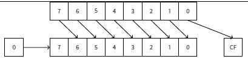

# 位域

很多函数参数的输入标志使用了位域。当然，可以使用bool类型来替代，只是有点浪费。

## 17.1 Specific bit checking

### 17.1.1 x86

Win32 API 例子:

```
    HANDLE fh;

    fh=CreateFile("file", GENERIC_WRITE | GENERIC_READ, FILE_SHARE_READ, NULL, OPEN_ALWAYS, FILE_ATTRIBUTE_NORMAL, NULL);
```

MSVC 2010： Listing 17.1: MSVC 2010

```
push    0
push    128            ; 00000080H
push    4
push    0
push    1
push    -1073741824    ; c0000000H
push    OFFSET $SG78813
call    DWORD PTR __imp__CreateFileA@28
mov     DWORD PTR _fh$[ebp], eax
```

我们再查看WinNT.h:

Listing 17.2: WinNT.h

```
#define GENERIC_READ (0x80000000L)
#define GENERIC_WRITE (0x40000000L)
#define GENERIC_EXECUTE (0x20000000L)
#define GENERIC_ALL (0x10000000L)
```

容易看出GENERIC_READ | GENERIC_WRITE = 0x80000000 | 0x40000000 = 0xC0000000，该值作为CreateFile()1函数的第二个参数。 CreateFile()如何检查该标志呢？ 以Windows XP SP3 x86为例，在kernel32.dll中查看CreateFileW检查该标志的代码片段： Listing 17.3: KERNEL32.DLL (Windows XP SP3 x86)

```
.text:7C83D429 test byte ptr [ebp+dwDesiredAccess+3], 40h
.text:7C83D42D mov [ebp+var_8], 1
.text:7C83D434 jz short loc_7C83D417
.text:7C83D436 jmp loc_7C810817
```

我们来看TEST指令，该指令并未检测整个第二个参数，仅检测关键的一个字节(ebp+dwDesiredAccess+3)，检测0x40标志（这里代表GENERIC_WRITE标志）。 Test对两个参数(目标，源)执行AND逻辑操作,并根据结果设置标志寄存器,结果本身不会保存（CMP和SUB与此类似（6.6.1））。 该代码片段逻辑如下：

`if ((dwDesiredAccess&0x40000000) == 0) goto loc_7C83D417`

如果AND指令没有设置ZF位，JZ将不触发跳转。如果dwDesiredAccess不等于0x40000000，AND结果将是0，ZF位将会被设置，条件跳转将被触发。

我们在linux GCC 4.4.1下查看：

```
#include <stdio.h>
#include <fcntl.h>
void main()
{
    int handle;

    handle=open ("file", O_RDWR | O_CREAT);
};
```

我们得到： Listing 17.4: GCC 4.4.1

```
    public main
main proc near
 
 
var_20 = dword ptr -20h
var_1C = dword ptr -1Ch
var_4 = dword ptr -4
 
 
    push ebp
    mov ebp, esp
    and esp, 0FFFFFFF0h
    sub esp, 20h
    mov [esp+20h+var_1C], 42h
    mov [esp+20h+var_20], offset aFile ; "file"
    call _open
    mov [esp+20h+var_4], eax
    leave
    retn
main endp
```

我们在libc.so.6库中查看open()函数，看到syscall： Listing 17.5: open() (libc.so.6)

```
.text:000BE69B mov edx, [esp+4+mode] ; mode
.text:000BE69F mov ecx, [esp+4+flags] ; flags
.text:000BE6A3 mov ebx, [esp+4+filename] ; filename
.text:000BE6A7 mov eax, 5
.text:000BE6AC int 80h ; LINUX - sys_open
```

因此open()对于标志位的检测在内核中。 对于linux2.6，当sys_open被调用时，最终传递到do_sys_open内核函数，然后进入do_filp_open()函数（该函数位于源码fs/namei.c中）。 除了通过堆栈传递参数，还可以通过寄存器传递方式，这种调用方式成为fastcall(47.3)。这种调用方式CPU不需要访问堆栈就可以直接读取参数的值，所以速度更快。GCC有编译选项regram2，可以设置通过寄存器传递的参数的个数。 Linux2.6内核编译附加选项为-mregram=33 4。 这意味着前3个参数通过EAX、EDX、ECX寄存器传递，剩余的参数通过堆栈传递。如果参数小于3，仅部分寄存器被使用。 我们下载linux内核2.6.31源码，在Ubuntu中编译：make vmlinux，在IDA中打开，找到do_filp_open()函数。在开始部分我们可以看到（注释个人添加）： Listing 17.6:do_filp_open() (linux kernel 2.6.31)

```
do_filp_open proc near
...
    push ebp
    mov ebp, esp
    push edi
    push esi
    push ebx
    mov ebx, ecx
    add ebx, 1
    sub esp, 98h
    mov esi, [ebp+arg_4] ; acc_mode (5th arg)
    test bl, 3
    mov [ebp+var_80], eax ; dfd (1th arg)
    mov [ebp+var_7C], edx ; pathname (2th arg)
    mov [ebp+var_78], ecx ; open_flag (3th arg)
    jnz short loc_C01EF684
    mov ebx, ecx ; ebx <- open_flag
```

GCC保存3个参数的值到堆栈。否则，可能会造成寄存器浪费。 我们来看代码片段： Listing 17.7: do_filp_open() (linux kernel 2.6.31)

```
loc_C01EF6B4:            ; CODE XREF: do_filp_open+4F
    test bl, 40h         ; O_CREAT
    jnz loc_C01EF810
    mov edi, ebx
    shr edi, 11h
    xor edi, 1
    and edi, 1
    test ebx, 10000h
    jz short loc_C01EF6D3
    or edi, 2
```

O_CREAT宏等于0x40，如果open_flag为0x40，标志位被置1，接下来的JNZ指令将被触发。

### 17.1.2 ARM

Linux kernel3.8.0检测O_CREAT过程有点不同。 Listing 17.8: linux kernel 3.8.0

```
struct file *do_filp_open(int dfd, struct filename *pathname, const struct open_flags *op)
{
... filp = path_openat(dfd, pathname, &nd, op, flags | LOOKUP_RCU); ... 
}

static struct file *path_openat(int dfd, struct filename *pathname, struct nameidata *nd, const struct open_flags *op, int flags)

{
... error = do_last(nd, &path, file, op, &opened, pathname); ... 
}

static int do_last(struct nameidata *nd, struct path *path, struct file *file, const struct open_flags *op, int *opened, struct filename *name) 
{
	...
    if (!(open_flag & O_CREAT)) {
        ...
        error = lookup_fast(nd, path, &inode);
        ...
    } else {
        ... error = complete_walk(nd);
    }
    ...
}
```

在IDA中查看ARM模式内核： Listing 17.9: do_last() (vmlinux)

```
...
.text:C0169EA8 MOV           R9, R3 ; R3 - (4th argument) open_flag
...
.text:C0169ED4 LDR           R6, [R9] ; R6 - open_flag
...
.text:C0169F68 TST           R6, #0x40 ; jumptable C0169F00 default case
.text:C0169F6C BNE           loc_C016A128
.text:C0169F70 LDR           R2, [R4,#0x10]
.text:C0169F74 ADD           R12, R4, #8
.text:C0169F78 LDR           R3, [R4,#0xC]
.text:C0169F7C MOV           R0, R4
.text:C0169F80 STR           R12, [R11,#var_50]
.text:C0169F84 LDRB          R3, [R2,R3]
.text:C0169F88 MOV           R2, R8
.text:C0169F8C CMP           R3, #0
.text:C0169F90 ORRNE         R1, R1, #3
.text:C0169F94 STRNE         R1, [R4,#0x24]
.text:C0169F98 ANDS          R3, R6, #0x200000
.text:C0169F9C MOV           R1, R12
.text:C0169FA0 LDRNE         R3, [R4,#0x24]
.text:C0169FA4 ANDNE         R3, R3, #1
.text:C0169FA8 EORNE         R3, R3, #1
.text:C0169FAC STR           R3, [R11,#var_54]
.text:C0169FB0 SUB           R3, R11, #-var_38
.text:C0169FB4 BL            lookup_fast
...
.text:C016A128 loc_C016A128          ; CODE XREF: do_last.isra.14+DC
.text:C016A128 MOV           R0, R4
.text:C016A12C BL            complete_walk
...
```

TST指令类似于x86下的TEST指令。 这段代码来自do_last()函数源码，有两个分支lookup_fast()和complete_walk()。这里O_CREAT宏也等于0x40。

## 17.2 Specific bit setting/clearing

例如：

```
#define IS_SET(flag, bit) ((flag) & (bit))
#define SET_BIT(var, bit) ((var) |= (bit))
#define REMOVE_BIT(var, bit) ((var) &= ~(bit))
int f(int a)
{
    int rt=a;
    SET_BIT (rt, 0x4000);
    REMOVE_BIT (rt, 0x200);

    return rt;
};
```

### 17.2.1 x86

MSVC 2010: Listing 17.10: MSVC 2010

```
_rt$ = -4 ; size = 4
_a$ = 8 ; size = 4
_f PROC
push ebp
mov ebp, esp
push ecx
mov eax, DWORD PTR _a$[ebp]
mov DWORD PTR _rt$[ebp], eax
mov ecx, DWORD PTR _rt$[ebp]
or ecx, 16384            ; 00004000H
mov DWORD PTR _rt$[ebp], ecx
mov edx, DWORD PTR _rt$[ebp]
and edx, -513            ; fffffdffH
mov DWORD PTR _rt$[ebp], edx
mov eax, DWORD PTR _rt$[ebp]
mov esp, ebp
pop ebp
ret 0
_f ENDP
```

OR指令添加一个或多个bit位而忽略了其余位。 AND用来重置一个bit位。 如果我们使用msvc编译，并且打开优化选项(/Ox)，代码将会更短： Listing 17.11: Optimizing MSVC

```
_a$ = 8          ; size = 4
_f PROC
    mov eax, DWORD PTR _a$[esp-4]
    and eax, -513    ; fffffdffH
    or eax, 16384    ; 00004000H
    ret 0
_f ENDP
```

我们来看GCC 4.4.1无优化的代码：

```
            public f
f           proc near
var_4       = dword ptr -4
arg_0       = dword ptr 8
        push ebp
        mov ebp, esp
        sub esp, 10h
        mov eax, [ebp+arg_0]
        mov [ebp+var_4], eax
        or [ebp+var_4], 4000h
        and [ebp+var_4], 0FFFFFDFFh
        mov eax, [ebp+var_4]
        leave
        retn
f           endp
```

MSVC未优化的代码有些冗余。 现在我们来看GCC打开优化选项-O3：

Listing 17.13: Optimizing GCC

```
    public f
f       proc near
arg_0 = dword ptr 8
    push ebp
    mov ebp, esp
    mov eax, [ebp+arg_0]
    pop ebp
    or ah, 40h
    and ah, 0FDh
    retn
f       endp
```

代码更短。值得注意的是编译器使用了AH寄存器-EAX寄存器8bit-15bit部分。


8086 16位CPU累加器被称为AX，包含两个8位部分-AL（低字节）和AH（高字节）。在80386下所有寄存器被扩展为32位，累加器被命名为EAX，为了保持兼容性，它的老的部分仍可以作为AX/AH/AL寄存器来访问。 因为所有的x86 CPU都兼容于16位CPU，所以老的16位操作码比32位操作码更短。”or ah,40h”指令仅复制3个字节比“or eax,04000h”需要复制5个字节甚至6个字节（如果第一个操作码不是EAX）更合理。 编译时候开启-O3并且设置regram=3生成的代码会更短。

Listing 17.14: Optimizing GCC

```
        public f
f       proc near
    push ebp
    or ah, 40h
    mov ebp, esp
    and ah, 0FDh
    pop ebp
    retn
f       endp
```

事实上，第一个参数已经被加载到EAX了，所以可以直接使用了。值得注意的是，函数序言（push ebp/mov ebp,esp）和结语（pop ebp）很容易被忽略。GCC并没有优化掉这些代码。更短的代码可以使用内联函数（27）。

### 17.2.2 ARM + Optimizing Keil + ARM mode

Listing 17.15: Optimizing Keil + ARM mode

```
02 0C C0 E3     BIC     R0, R0, #0x200
01 09 80 E3     ORR     R0, R0, #0x4000
1E FF 2F E1     BX  LR
```

BIC是“逻辑and“类似于x86下的AND。ORR是”逻辑or“类似于x86下的OR。

### 17.2.3 ARM + Optimizing Keil + thumb mode

Listing 17.16: Optimizing Keil + thumb mode

```
01 21 89 03     MOVS     R1, 0x4000
08 43       ORRS     R0, R1
49 11       ASRS     R1, R1, #5 ; generate 0x200 and place to R1
88 43       BICS     R0, R1
70 47       BX   LR5
```

从0x4000右移生成0x200，采用移位使代码更简洁。

### 17.2.4 ARM + Optimizing Xcode (LLVM) + ARM mode

Listing 17.17: Optimizing Xcode (LLVM) + ARM mode

```
42 0C C0 E3     BIC     R0, R0, #0x4200
01 09 80 E3     ORR     R0, R0, #0x4000
1E FF 2F E1     BX  LR
```

该代码由LLVM生成，从源码形式上看，看起来更像是：

```
REMOVE_BIT (rt, 0x4200);
SET_BIT (rt, 0x4000);
```

为什么是0x4200?可能是编译器构造的5，可能是编译器编译错误，但生成的代码是可用的。 更多编译器异常请参考相关资料（67）。 对于thumb模式，优化Xcode(LLVM)生成的代码相似。

## 17.3 Shifts

C/C++的移位操作通过<<和>>实现。 这里有一个例子函数，计算输入变量有多少个位被置为1.

```
#define IS_SET(flag, bit) ((flag) & (bit))
int f(unsigned int a)
{
    int i;
    int rt=0;
    for (i=0; i<32; i++)
        if (IS_SET (a, 1<<i))
            rt++;
        return rt;
    };
```

在循环中，迭代计数从0到31，1<<i语句将计数从1到0x80000000。1<<i即1左移n位，将包含32位数字所有可能的bit位。每次移位仅有1位被置1，其它位均为0，IS_SET宏将判断a对应的位是否置1。


IS_SET宏就是逻辑与(AND)操作，如果对应的位不为1，则返回0。if条件表达式如果不为0，if()将被触发。

## 17.3.1 x86

MSVC 2010:

Listing 17.18: MSVC 2010

```
_rt$ = -8       ; size = 4
_i$ = -4        ; size = 4
_a$ = 8         ; size = 4
_f PROC
    push ebp
    mov ebp, esp
    sub esp, 8
    mov DWORD PTR _rt$[ebp], 0
    mov DWORD PTR _i$[ebp], 0
    jmp SHORT $LN4@f
$LN3@f:
    mov eax, DWORD PTR _i$[ebp]     ; increment of 1
    add eax, 1
    mov DWORD PTR _i$[ebp], eax
$LN4@f:
    cmp DWORD PTR _i$[ebp], 32      ; 00000020H
    jge SHORT $LN2@f            ; loop finished?
    mov edx, 1
    mov ecx, DWORD PTR _i$[ebp]
    shl edx, cl             ; EDX=EDX<<CL
    and edx, DWORD PTR _a$[ebp]
    je SHORT $LN1@f             ; result of AND instruction was 0?
    ; then skip next instructions
    mov eax, DWORD PTR _rt$[ebp]    ; no, not zero
    add eax, 1 ; increment rt
    mov DWORD PTR _rt$[ebp], eax
$LN1@f:
    jmp SHORT $LN3@f
$LN2@f:
    mov eax, DWORD PTR _rt$[ebp]
    mov esp, ebp
    pop ebp
    ret 0
_f ENDP
```

下面是GCC 4.4.1编译的代码： Listing 17.19: GCC 4.4.1

```
        public f
f           proc near
rt      = dword ptr -0Ch
i       = dword ptr -8
arg_0   = dword ptr 8
 
        push ebp
        mov ebp, esp
        push ebx
        sub esp, 10h
        mov [ebp+rt], 0
        mov [ebp+i], 0
        jmp short loc_80483EF
loc_80483D0:
        mov eax, [ebp+i]
        mov edx, 1
        mov ebx, edx
        mov ecx, eax
        shl ebx, cl
        mov eax, ebx
        and eax, [ebp+arg_0]
        test eax, eax
        jz short loc_80483EB
        add [ebp+rt], 1
loc_80483EB:
        add [ebp+i], 1
loc_80483EF:
        cmp [ebp+i], 1Fh
            jle short loc_80483D0
            mov eax, [ebp+rt]
        add esp, 10h
        pop ebx
        pop ebp
        retn
f           endp
```

在乘以或者除以2的指数值（1,2,4,8等）时经常使用移位操作。 例如：

```
unsigned int f(unsigned int a)
{
    return a/4;
};
```

MSVC 2010: Listing 17.20: MSVC 2010

```
_a$ = 8                     ; size = 4
_f      PROC
        mov eax, DWORD PTR _a$[esp-4]
        shr eax, 2
        ret 0
_f ENDP
```

例子中的SHR（逻辑右移）指令将a值右移2位，最高两位被置0，最低2位被丢弃。实施上丢弃的两位是除法的余数。 SHR作用类似SHL只是移位方向不同。



使用十进制23很好来理解。23除以10，丢弃最后的数字（3是余数），商为2。 与此类似的是乘法。比如乘以4，仅需将数字左移2位，最低两位被置0。就像3乘以100—仅仅在最后补两个0就行了。

### 17.3.2 ARM + Optimizing Xcode (LLVM) + ARM mode

Listing 17.21: Optimizing Xcode (LLVM) + ARM mode

```
        MOV R1, R0
        MOV R0, #0
        MOV R2, #1
        MOV R3, R0
loc_2E54
        TST R1, R2,LSL R3       ; set flags according to R1 & (R2<<R3)
        ADD R3, R3, #1      ; R3++
        ADDNE R0, R0, #1        ; if ZF flag is cleared by TST, R0++
        CMP R3, #32
        BNE loc_2E54
        BX LR
```

TST类似于x86下的TEST指令。 正如我前面提到的(14.2.1)，ARM模式下没有单独的移位指令。对于用作修饰的LSL（逻辑左移）、LSR（逻辑右移）、ASR（算术右移）、ROR（循环右移）和RRX（带扩展的循环右移指令），需要与MOV，TST，CMP，ADD，SUB，RSB结合来使用6。 这些修饰指令被定义，第二个操作数指定移动的位数。 因此“TST R1, R2,LSL R3”指令所做的工作为????1 ∧ (????2 ≪ ????3).

### 17.3.3 ARM + Optimizing Xcode (LLVM) + thumb-2 mode

几乎一样，只是这里使用LSL.W/TST指令而不是只有TST。因为Thumb模式下TST没有定义修饰符LSL。

```
    MOV     R1, R0
    MOVS    R0, #0
    MOV.W   R9, #1
    MOVS    R3, #0
loc_2F7A
    LSL.W   R2, R9, R3
    TST     R2, R1
    ADD.W   R3, R3, #1
    IT NE
    ADDNE   R0, #1
    CMP     R3, #32
    BNE     loc_2F7A
    BX      LR
```

###　17.4 CRC32哈希散列计算例子

这是非常流行的CRC32哈希散列计算。

```
/* By Bob Jenkins, (c) 2006, Public Domain */
#include <stdio.h>
#include <stddef.h>
#include <string.h>
typedef unsigned long ub4;
typedef unsigned char ub1;
static const ub4 crctab[256] = {
    0x00000000, 0x77073096, 0xee0e612c, 0x990951ba, 0x076dc419, 0x706af48f,
    0xe963a535, 0x9e6495a3, 0x0edb8832, 0x79dcb8a4, 0xe0d5e91e, 0x97d2d988,
    0x09b64c2b, 0x7eb17cbd, 0xe7b82d07, 0x90bf1d91, 0x1db71064, 0x6ab020f2,
    0xf3b97148, 0x84be41de, 0x1adad47d, 0x6ddde4eb, 0xf4d4b551, 0x83d385c7,
    0x136c9856, 0x646ba8c0, 0xfd62f97a, 0x8a65c9ec, 0x14015c4f, 0x63066cd9,
    0xfa0f3d63, 0x8d080df5, 0x3b6e20c8, 0x4c69105e, 0xd56041e4, 0xa2677172,
    0x3c03e4d1, 0x4b04d447, 0xd20d85fd, 0xa50ab56b, 0x35b5a8fa, 0x42b2986c,
    0xdbbbc9d6, 0xacbcf940, 0x32d86ce3, 0x45df5c75, 0xdcd60dcf, 0xabd13d59,
    0x26d930ac, 0x51de003a, 0xc8d75180, 0xbfd06116, 0x21b4f4b5, 0x56b3c423,
    0xcfba9599, 0xb8bda50f, 0x2802b89e, 0x5f058808, 0xc60cd9b2, 0xb10be924,
    0x2f6f7c87, 0x58684c11, 0xc1611dab, 0xb6662d3d, 0x76dc4190, 0x01db7106,
    0x98d220bc, 0xefd5102a, 0x71b18589, 0x06b6b51f, 0x9fbfe4a5, 0xe8b8d433,
    0x7807c9a2, 0x0f00f934, 0x9609a88e, 0xe10e9818, 0x7f6a0dbb, 0x086d3d2d,
    0x91646c97, 0xe6635c01, 0x6b6b51f4, 0x1c6c6162, 0x856530d8, 0xf262004e,
    0x6c0695ed, 0x1b01a57b, 0x8208f4c1, 0xf50fc457, 0x65b0d9c6, 0x12b7e950,
    0x8bbeb8ea, 0xfcb9887c, 0x62dd1ddf, 0x15da2d49, 0x8cd37cf3, 0xfbd44c65,
    0x4db26158, 0x3ab551ce, 0xa3bc0074, 0xd4bb30e2, 0x4adfa541, 0x3dd895d7,
    0xa4d1c46d, 0xd3d6f4fb, 0x4369e96a, 0x346ed9fc, 0xad678846, 0xda60b8d0,
    0x44042d73, 0x33031de5, 0xaa0a4c5f, 0xdd0d7cc9, 0x5005713c, 0x270241aa,
    0xbe0b1010, 0xc90c2086, 0x5768b525, 0x206f85b3, 0xb966d409, 0xce61e49f,
    0x5edef90e, 0x29d9c998, 0xb0d09822, 0xc7d7a8b4, 0x59b33d17, 0x2eb40d81,
    0xb7bd5c3b, 0xc0ba6cad, 0xedb88320, 0x9abfb3b6, 0x03b6e20c, 0x74b1d29a,
    0xead54739, 0x9dd277af, 0x04db2615, 0x73dc1683, 0xe3630b12, 0x94643b84,
    0x0d6d6a3e, 0x7a6a5aa8, 0xe40ecf0b, 0x9309ff9d, 0x0a00ae27, 0x7d079eb1,
    0xf00f9344, 0x8708a3d2, 0x1e01f268, 0x6906c2fe, 0xf762575d, 0x806567cb,
    0x196c3671, 0x6e6b06e7, 0xfed41b76, 0x89d32be0, 0x10da7a5a, 0x67dd4acc,
    0xf9b9df6f, 0x8ebeeff9, 0x17b7be43, 0x60b08ed5, 0xd6d6a3e8, 0xa1d1937e,
    0x38d8c2c4, 0x4fdff252, 0xd1bb67f1, 0xa6bc5767, 0x3fb506dd, 0x48b2364b,
    0xd80d2bda, 0xaf0a1b4c, 0x36034af6, 0x41047a60, 0xdf60efc3, 0xa867df55,
    0x316e8eef, 0x4669be79, 0xcb61b38c, 0xbc66831a, 0x256fd2a0, 0x5268e236,
    0xcc0c7795, 0xbb0b4703, 0x220216b9, 0x5505262f, 0xc5ba3bbe, 0xb2bd0b28,
    0x2bb45a92, 0x5cb36a04, 0xc2d7ffa7, 0xb5d0cf31, 0x2cd99e8b, 0x5bdeae1d,
    0x9b64c2b0, 0xec63f226, 0x756aa39c, 0x026d930a, 0x9c0906a9, 0xeb0e363f,
    0x72076785, 0x05005713, 0x95bf4a82, 0xe2b87a14, 0x7bb12bae, 0x0cb61b38,
    0x92d28e9b, 0xe5d5be0d, 0x7cdcefb7, 0x0bdbdf21, 0x86d3d2d4, 0xf1d4e242,
    0x68ddb3f8, 0x1fda836e, 0x81be16cd, 0xf6b9265b, 0x6fb077e1, 0x18b74777,
    0x88085ae6, 0xff0f6a70, 0x66063bca, 0x11010b5c, 0x8f659eff, 0xf862ae69,
    0x616bffd3, 0x166ccf45, 0xa00ae278, 0xd70dd2ee, 0x4e048354, 0x3903b3c2,
    0xa7672661, 0xd06016f7, 0x4969474d, 0x3e6e77db, 0xaed16a4a, 0xd9d65adc,
    0x40df0b66, 0x37d83bf0, 0xa9bcae53, 0xdebb9ec5, 0x47b2cf7f, 0x30b5ffe9,
    0xbdbdf21c, 0xcabac28a, 0x53b39330, 0x24b4a3a6, 0xbad03605, 0xcdd70693,
    0x54de5729, 0x23d967bf, 0xb3667a2e, 0xc4614ab8, 0x5d681b02, 0x2a6f2b94,
    0xb40bbe37, 0xc30c8ea1, 0x5a05df1b, 0x2d02ef8d,
};
/* how to derive the values in crctab[] from polynomial 0xedb88320 */
void build_table()
{
    ub4 i, j;
    for (i=0; i<256; ++i) {
        j = i;
        j = (j>>1) ^ ((j&1) ? 0xedb88320 : 0);
        j = (j>>1) ^ ((j&1) ? 0xedb88320 : 0);
        j = (j>>1) ^ ((j&1) ? 0xedb88320 : 0);
        j = (j>>1) ^ ((j&1) ? 0xedb88320 : 0);
        j = (j>>1) ^ ((j&1) ? 0xedb88320 : 0);
        j = (j>>1) ^ ((j&1) ? 0xedb88320 : 0);
        j = (j>>1) ^ ((j&1) ? 0xedb88320 : 0);
        j = (j>>1) ^ ((j&1) ? 0xedb88320 : 0);
        printf("0x%.8lx, ", j);
        if (i%6 == 5) printf("");
     }
}
/* the hash function */
ub4 crc(const void *key, ub4 len, ub4 hash)
{
    ub4 i;
    const ub1 *k = key;
    for (hash=len, i=0; i<len; ++i)
        hash = (hash >> 8) ^ crctab[(hash & 0xff) ^ k[i]];
    return hash;
}

/* To use, try "gcc -O crc.c -o crc; crc < crc.c" */
int main()
{
    char s[1000];
    while (gets(s)) printf("%.8lx", crc(s, strlen(s), 0));
    return 0;
}
```

我们只关心crc()函数。注意for()语句两个循环初始化：hash=len,i=0。标准C/C++允许这样做。循环体内通常需要使用两个初始化部分。 让我们用MSVC优化（/Ox）。为了简洁，仅列出crc()函数的代码，包括我做的注释。

```
key$ = 8               ; size = 4
_len$ = 12              ; size = 4
_hash$ = 16             ; size = 4
_crc PROC
    mov     edx, DWORD PTR _len$[esp-4]
    xor     ecx, ecx    ; i will be stored in ECX
    mov     eax, edx
    test    edx, edx
    jbe     SHORT $LN1@crc
    push    ebx
    push    esi
    mov     esi, DWORD PTR _key$[esp+4] ; ESI = key
    push    edi
$LL3@crc:
 
; work with bytes using only 32-bit registers. byte from address key+i we store into EDI
 
    movzx   edi, BYTE PTR [ecx+esi]
    mov     ebx, eax ; EBX = (hash = len)
    and     ebx, 255 ; EBX = hash & 0xff
; XOR EDI, EBX (EDI=EDI^EBX) - this operation uses all 32 bits of each register
; but other bits (8-31) are cleared all time, so it’s OK
; these are cleared because, as for EDI, it was done by MOVZX instruction above
; high bits of EBX was cleared by AND EBX, 255 instruction above (255 = 0xff)
 
    xor     edi, ebx
 
; EAX=EAX>>8; bits 24-31 taken "from nowhere" will be cleared
 
        shr     eax, 8
 
; EAX=EAX^crctab[EDI*4] - choose EDI-th element from crctab[] table
    xor     eax, DWORD PTR _crctab[edi*4]
    inc     ecx         ; i++
    cmp     ecx, edx ; i<len ?
    jb      SHORT $LL3@crc ; yes
    pop     edi
    pop     esi
    pop     ebx
$LN1@crc:
    ret 0
_crc ENDP
```

我们来看GCC 4.4.1优化后的代码：

```
    public crc
crc     proc near
key     = dword ptr 8
hash    = dword ptr 0Ch
push    ebp
xor     edx, edx
mov     ebp, esp
push    esi
mov     esi, [ebp+key]
push    ebx
mov     ebx, [ebp+hash]
test    ebx, ebx
mov     eax, ebx
jz      short loc_80484D3
nop                 ; padding
lea     esi, [esi+0]        ; padding; ESI doesn’t changing here
loc_80484B8:
mov     ecx, eax        ; save previous state of hash to ECX
xor     al, [esi+edx]       ; AL=*(key+i)
add     edx, 1          ; i++
shr     ecx, 8          ; ECX=hash>>8
movzx   eax, al         ; EAX=*(key+i)
mov     eax, dword ptr ds:crctab[eax*4]     ; EAX=crctab[EAX]
xor     eax, ecx        ; hash=EAX^ECX
cmp     ebx, edx
ja      short loc_80484B8
loc_80484D3:
    pop ebx
    pop esi
    pop ebp
    retn
crc endp
```

GCC在循环开始的时候通过填入NOP和lea esi,esi+0来按8字节对齐。更多信息请阅读npad小结（64）。