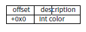
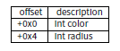

# 类

## 31.1

举个简单的例子。

在程序内部，C++类的表示基本和结构体一样。让我们试试这个有2个变量，2个构造函数和1个方法的类。

```
#include <stdio.h>
class c
{
private:
    int v1;
    int v2;
public:
    c() // default ctor
    {
        v1=667;
        v2=999;
    };
    c(int a, int b) // ctor
    {
        v1=a;
        v2=b;
    };
    void dump()
    {
        printf ("%d; %d", v1, v2);
    };
};

int main()
{
    class c c1;
    class c c2(5,6);
    c1.dump();
    c2.dump();
    return 0;
};
```

### 31.1.1 MSVC-X86

这里可以看到main（）函数是如何被翻译成汇编代码的：

```
_c2$ = -16 ; size = 8
_c1$ = -8 ; size = 8
_main PROC
push ebp
mov ebp, esp
sub esp, 16 ; 00000010H
lea ecx, DWORD PTR _c1$[ebp]
call ??0c@@QAE@XZ ; c::c
push 6
push 5
lea ecx, DWORD PTR _c2$[ebp]
call ??0c@@QAE@HH@Z ; c::c
lea ecx, DWORD PTR _c1$[ebp]
call ?dump@c@@QAEXXZ ; c::dump
lea ecx, DWORD PTR _c2$[ebp]
call ?dump@c@@QAEXXZ ; c::dump
xor eax, eax
mov esp, ebp
pop ebp
ret 0
_main ENDP
```

所以，发生什么了。对每个对象来说（而不是类c），会分配8个字节。这正好是2个变量存储所需的大小。 对c1来说一个默认的无参数构造函数??0c@@QAE@XZ会被调用。对c2来说另一个??0c@@QAE@HH@Z会被调用，有两个数字会被作为参数传递。 指向对象的指针（C\++术语的“this”）会被通过ECX寄存器传递。这被叫做thiscall（31.1.1）--这是一个指向对象的指针传递方式。 MSVC使用ECX来传递它。无需说明的是，它并不是一个标准化的方法，其他编译器可能用其他方法，例如通过第一个函数参数，比如GCC就是这么做的。 为什么函数的名字这么奇怪？这是因为名字打碎方式的缘故。 C\++类可能有多个同名的重载函数，因此，不同的类也可能有相同的函数名。 名字打碎可以把类的类名+函数名+参数类型编码到一个字符串里面，然后它就会被用作内部名称。这完全是因为编译器和DLL OS加载器都 不知道C\++或者面向对象的缘故。 Dump()函数在之后被调用了2次。 让我们看看构造函数的代码。

```
_this$ = -4 ; size = 4
??0c@@QAE@XZ PROC ; c::c, COMDAT
; _this$ = ecx
push ebp
mov ebp, esp
push ecx
mov DWORD PTR _this$[ebp], ecx
mov eax, DWORD PTR _this$[ebp]
mov DWORD PTR [eax], 667 ; 0000029bH
mov ecx, DWORD PTR _this$[ebp]
mov DWORD PTR [ecx+4], 999 ; 000003e7H
mov eax, DWORD PTR _this$[ebp]
mov esp, ebp
pop ebp
ret 0


??0c@@QAE@XZ ENDP ; c::c
_this$ = -4 ; size = 4
_a$ = 8 ; size = 4
_b$ = 12 ; size = 4
??0c@@QAE@HH@Z PROC ; c::c, COMDAT
; _this$ = ecx
push ebp
mov ebp, esp
push ecx
mov DWORD PTR _this$[ebp], ecx
mov eax, DWORD PTR _this$[ebp]
mov ecx, DWORD PTR _a$[ebp]
mov DWORD PTR [eax], ecx
mov edx, DWORD PTR _this$[ebp]
mov eax, DWORD PTR _b$[ebp]
mov DWORD PTR [edx+4], eax
mov eax, DWORD PTR _this$[ebp]
mov esp, ebp
pop ebp
ret 8
??0c@@QAE@HH@Z ENDP ; c::c
```

构造函数只是函数，它们会使用ECX中存储的指向结构体的指针，然后把指针指向自己的本地变量，但是，这个操作并不是必须的。 对C++标准来说我们知道构造函数不应该返回任何值。事实上，构造函数会返回指向新创建对象的指针，比如“this”。 现在看看dump（）函数：

```
_this$ = -4 ; size = 4
?dump@c@@QAEXXZ PROC ; c::dump, COMDAT
; _this$ = ecx
push ebp
mov ebp, esp
push ecx
mov DWORD PTR _this$[ebp], ecx
mov eax, DWORD PTR _this$[ebp]
mov ecx, DWORD PTR [eax+4]
push ecx
mov edx, DWORD PTR _this$[ebp]
mov eax, DWORD PTR [edx]
push eax
push OFFSET ??_C@_07NJBDCIEC@?$CFd?$DL?5?$CFd?6?$AA@
call _printf
add esp, 12 ; 0000000cH
mov esp, ebp
pop ebp
ret 0
?dump@c@@QAEXXZ ENDP ; c::dump
```

简单的可以：dump()会把带有2个int的结构体传给ecx，然后从他里面取出2个值，然后传给printf()。 如果使用/Ox优化，代码会更短。

```
??0c@@QAE@XZ PROC ; c::c, COMDAT
; _this$ = ecx
mov eax, ecx
mov DWORD PTR [eax], 667 ; 0000029bH
mov DWORD PTR [eax+4], 999 ; 000003e7H
ret 0
??0c@@QAE@XZ ENDP ; c::c
_a$ = 8 ; size = 4
_b$ = 12 ; size = 4
??0c@@QAE@HH@Z PROC ; c::c, COMDAT
; _this$ = ecx
mov edx, DWORD PTR _b$[esp-4]
mov eax, ecx
mov ecx, DWORD PTR _a$[esp-4]
mov DWORD PTR [eax], ecx
mov DWORD PTR [eax+4], edx
ret 8
??0c@@QAE@HH@Z ENDP ; c::c
?dump@c@@QAEXXZ PROC ; c::dump, COMDAT
; _this$ = ecx
mov eax, DWORD PTR [ecx+4]
mov ecx, DWORD PTR [ecx]
push eax
push ecx
push OFFSET ??_C@_07NJBDCIEC@?$CFd?$DL?5?$CFd?6?$AA@
call _printf
add esp, 12 ; 0000000cH
ret 0
?dump@c@@QAEXXZ ENDP ; c::dump
```

还要说的就是栈指针在调用add esp ，x之后并不正确。所以构造函数还需要ret 8来返回，而不是ret。 这是因为这儿调用方式是thiscall（31.1.1）,这个方法会使用栈来传递参数，和stdcall对比（47.2）来看，他将为被调用者维护正确的栈，而不是调用者。Ret x指令会额外的给esp加上x，然后会把控制流交还给调用者函数。 调用转换见47章。 还有需要注意的是，编译器会决定什么时候调用构造函数什么时候调用析构函数，但是我们从c++语言基础里面已经知道调用时机了。

### 31.1.2 MSVC-x86-64

像我们已经知道的那样，x86-64中前4个函数参数是通过RCX/RDX/R8/R9寄存器传递的，剩余的通过栈传递。但是this是用RCX传递的 ，而第一个函数参数是从RDX开始传递的。我们可以通过c(int a, int b)这个函数看出来。

```
; void dump()
?dump@c@@QEAAXXZ PROC ; c::dump
mov r8d, DWORD PTR [rcx+4]
mov edx, DWORD PTR [rcx]
lea rcx, OFFSET FLAT:??_C@_07NJBDCIEC@?$CFd?$DL?5?$CFd?6?$AA@ ; ’%d; %d’
jmp printf
?dump@c@@QEAAXXZ ENDP ; c::dump
; c(int a, int b)
??0c@@QEAA@HH@Z PROC ; c::c
mov DWORD PTR [rcx], edx ; 1st argument: a
mov DWORD PTR [rcx+4], r8d ; 2nd argument: b
mov rax, rcx
ret 0
??0c@@QEAA@HH@Z ENDP ; c::c
; default ctor
??0c@@QEAA@XZ PROC ; c::c
mov DWORD PTR [rcx], 667 ; 0000029bH
mov DWORD PTR [rcx+4], 999 ; 000003e7H
mov rax, rcx
ret 0
??0c@@QEAA@XZ ENDP ; c::c
```

X64中，Int数据类型依然是32位的。所以这里也使用了32位寄存器部分。 我们还可以看到dump()里的JMP printf，而不是RET，这个技巧我们已经在11.1.1里面见过了。

### 31.1.3 GCC-x86

几乎和GCC4.4.1一样的结果，除了几个例外。

```
public main
main proc near ; DATA XREF: _start+17
var_20 = dword ptr -20h
var_1C = dword ptr -1Ch
var_18 = dword ptr -18h
var_10 = dword ptr -10h
var_8 = dword ptr -8
push ebp
mov ebp, esp
and esp, 0FFFFFFF0h
sub esp, 20h
lea eax, [esp+20h+var_8]
mov [esp+20h+var_20], eax
call _ZN1cC1Ev
mov [esp+20h+var_18], 6
mov [esp+20h+var_1C], 5
lea eax, [esp+20h+var_10]
mov [esp+20h+var_20], eax
call _ZN1cC1Eii
lea eax, [esp+20h+var_8]
mov [esp+20h+var_20], eax
call _ZN1c4dumpEv
lea eax, [esp+20h+var_10]
mov [esp+20h+var_20], eax
call _ZN1c4dumpEv
mov eax, 0
leave
retn
main endp
```

我们可以看到另一个命名破碎模式，这个GNU特殊的模式可以看到指向对象的this时针其实是作为函数的第一个参数被传入的，当然，这个对程序员来说是透明的。 第一个构造函数：

```
public _ZN1cC1Ev ; weak
_ZN1cC1Ev proc near ; CODE XREF: main+10
arg_0 = dword ptr 8
push ebp
mov ebp, esp
mov eax, [ebp+arg_0]
mov dword ptr [eax], 667
mov eax, [ebp+arg_0]
mov dword ptr [eax+4], 999
pop ebp
retn
_ZN1cC1Ev endp
```

他所做的无非就是使用第一个传来的参数写入两个数字。 第二个构造函数：

```
public _ZN1cC1Eii
_ZN1cC1Eii proc near
arg_0 = dword ptr 8
arg_4 = dword ptr 0Ch
arg_8 = dword ptr 10h
push ebp
mov ebp, esp
mov eax, [ebp+arg_0]
mov edx, [ebp+arg_4]
mov [eax], edx
mov eax, [ebp+arg_0]
mov edx, [ebp+arg_8]
mov [eax+4], edx
pop ebp
retn
_ZN1cC1Eii endp
```

这是个函数，原型类似于：

```
void ZN1cC1Eii (int *obj, int a, int b)
{
    *obj=a;
    *(obj+1)=b;
};
```

这是完全可以预测到的，现在看看dump（）：

```
public _ZN1c4dumpEv
_ZN1c4dumpEv proc near
var_18 = dword ptr -18h
var_14 = dword ptr -14h
var_10 = dword ptr -10h
arg_0 = dword ptr 8
push ebp
mov ebp, esp
sub esp, 18h
mov eax, [ebp+arg_0]
mov edx, [eax+4]
mov eax, [ebp+arg_0]
mov eax, [eax]
mov [esp+18h+var_10], edx
mov [esp+18h+var_14], eax
mov [esp+18h+var_18], offset aDD ; "%d; %d
"
call _printf
leave
retn
_ZN1c4dumpEv endp
```

在这个函数的内部表达中有一个单独的参数，被用作指向当前对象，也即this。 因此，如果从这些简单的例子来看，MSVC和GCC的区别也就只有函数名编码的区别和传入this指针的区别（ECX寄存器或通过第一个参数）。

### 31.1.14 GCC-X86-64

前6个参数，会通过RDI/RSI/RDX/RCX/R8/R9[21章]的顺序传递，this指针会通过第一个RDI来传递，我们可以接着看到。 Int数据类型也是一个32位的数据，JMP替换RET的技巧这里也用到了。

```
; default ctor
_ZN1cC2Ev:
mov DWORD PTR [rdi], 667
mov DWORD PTR [rdi+4], 999
ret
; c(int a, int b)
_ZN1cC2Eii:
mov DWORD PTR [rdi], esi
mov DWORD PTR [rdi+4], edx
ret
; dump()
_ZN1c4dumpEv:
mov edx, DWORD PTR [rdi+4]
mov esi, DWORD PTR [rdi]
xor eax, eax
mov edi, OFFSET FLAT:.LC0 ; "%d; %d
"
jmp printf
```

## 31.2 类继承

可以说关于类继承就是我们已经研究了的这个结构体，但是它现在扩展成类了。 让我们看个简单的例子：

```
#include <stdio.h>
class object
{
public:
int color;
object() { };
object (int color) { this->color=color; };
void print_color() { printf ("color=%d
", color); };
};
class box : public object
{
private:
int width, height, depth;
public:
box(int color, int width, int height, int depth)
{
this->color=color;
this->width=width;
this->height=height;
this->depth=depth;
};
void dump()
{
printf ("this is box. color=%d, width=%d, height=%d, depth=%d
", color, width,
height, depth);
};
};
class sphere : public object
{
private:
    int radius;
public:
    sphere(int color, int radius)
    {
        this->color=color;
        this->radius=radius;
    };
void dump()
{
    printf ("this is sphere. color=%d, radius=%d", color, radius);};
};
int main()
{
    box b(1, 10, 20, 30);
    sphere s(2, 40);
    b.print_color();
    s.print_color();
    b.dump();
    s.dump();
    return 0;
};
```

让我们观察一下生成的dump()的代码和object::print_color()，让我们看看结构体对象的内存输出（作为32位代码） 所以，dump()方法其实是对应了好几个类，下面代码由MSVC 2008生成（/Ox+/Ob0） 优化的MSVC 2008 /Ob0

```
??_C@_09GCEDOLPA@color?$DN?$CFd?6?$AA@ DB ’color=%d’, 0aH, 00H ; ‘string’
?print_color@object@@QAEXXZ PROC ; object::print_color, COMDAT
; _this$ = ecx
mov eax, DWORD PTR [ecx]
push eax
; ’color=%d’, 0aH, 00H
push OFFSET ??_C@_09GCEDOLPA@color?$DN?$CFd?6?$AA@
call _printf
add esp, 8
ret 0
?print_color@object@@QAEXXZ ENDP ; object::print_color
```

优化的MSVC2008 /Ob0

```
?dump@box@@QAEXXZ PROC ; box::dump, COMDAT
; _this$ = ecx
mov eax, DWORD PTR [ecx+12]
mov edx, DWORD PTR [ecx+8]
push eax
mov eax, DWORD PTR [ecx+4]
mov ecx, DWORD PTR [ecx]
push edx
push eax
push ecx
; ’this is box. color=%d, width=%d, height=%d, depth=%d’, 0aH, 00H ; ‘string’
push OFFSET ??_C@_0DG@NCNGAADL@this?5is?5box?4?5color?$DN?$CFd?0?5width?$DN?$CFd?0@
call _printf
add esp, 20 ; 00000014H
ret 0
?dump@box@@QAEXXZ ENDP ; box::dump

?dump@sphere@@QAEXXZ PROC ; sphere::dump, COMDAT
; _this$ = ecx
mov eax, DWORD PTR [ecx+4]
mov ecx, DWORD PTR [ecx]
push eax
push ecx
; ’this is sphere. color=%d, radius=%d’, 0aH, 00H
push OFFSET ??_C@_0CF@EFEDJLDC@this?5is?5sphere?4?5color?$DN?$CFd?0?5radius@
call _printf
add esp, 12 ; 0000000cH
ret 0
?dump@sphere@@QAEXXZ ENDP ; sphere::dump
```

所以，这就是他的内存暑促后：（基类对象）



继承的对象 Box：


Sphere:



让我们看看main()函数体：

```
PUBLIC _main
_TEXT SEGMENT
_s$ = -24 ; size = 8
_b$ = -16 ; size = 16
_main PROC
sub esp, 24 ; 00000018H
push 30 ; 0000001eH
push 20 ; 00000014H
push 10 ; 0000000aH
push 1
lea ecx, DWORD PTR _b$[esp+40]
call ??0box@@QAE@HHHH@Z ; box::box
push 40 ; 00000028H
push 2
lea ecx, DWORD PTR _s$[esp+32]
call ??0sphere@@QAE@HH@Z ; sphere::sphere
lea ecx, DWORD PTR _b$[esp+24]
call ?print_color@object@@QAEXXZ ; object::print_color
lea ecx, DWORD PTR _s$[esp+24]
call ?print_color@object@@QAEXXZ ; object::print_color
lea ecx, DWORD PTR _b$[esp+24]
call ?dump@box@@QAEXXZ ; box::dump
lea ecx, DWORD PTR _s$[esp+24]
call ?dump@sphere@@QAEXXZ ; sphere::dump
xor eax, eax
add esp, 24 ; 00000018H
ret 0
_main ENDP
```

继承的类必须永远将它们的范围添加到基类的范围中，所以这样可以让基类的方法对其范围生效。 当object::print_color()方法被调用时，会有一个指针指向box对象和sphere对象会被传递进去，它就是“this”。它可以和这些对象简单的互动，因为color域指向的永远是固定的地址（+0x00偏移）。 可以说，object::print_color()方法对于输入对象类型来说是不可知的，如果你创建一个继承类，例如继承了box类编译器会自动在depth域之后加上新域，而把box的类域固定在一个固定的位置。 因此，box::dump()方法会在访问color/width/height/depths的时候顺利工作，因为地址的固定，它会很容易的知道偏移。 GCC生成的代码基本一样，只有一个不一样的就是this的传递，就像之前说的一样，它是作为第一个参数传递的，而不是通过ECX传递的。

## 31.3 封装

封装是一个把数据装在类的private域里面的动作，这样会让它们只能从类的内部被访问到，而从外面访问不到。 但是，生成的代码里面是否有什么东西指示一个变量是private呢？ 没有，让我们看看简单的例子：

```
#include <stdio.h>
class box
{
private:
int color, width, height, depth;
public:
box(int color, int width, int height, int depth)
{
this->color=color;
this->width=width;
this->height=height;
this->depth=depth;
};
void dump()
{
printf ("this is box. color=%d, width=%d, height=%d, depth=%d
", color, width,
height, depth);
};
};
```

在MSVC 2008+/Ox和/Ob0选项，然后看看box::dump()代码：

```
?dump@box@@QAEXXZ PROC ; box::dump, COMDAT
; _this$ = ecx
mov eax, DWORD PTR [ecx+12]
mov edx, DWORD PTR [ecx+8]
push eax
mov eax, DWORD PTR [ecx+4]
mov ecx, DWORD PTR [ecx]
push edx
push eax
push ecx
; ’this is box. color=%d, width=%d, height=%d, depth=%d’, 0aH, 00H
push OFFSET ??_C@_0DG@NCNGAADL@this?5is?5box?4?5color?$DN?$CFd?0?5width?$DN?$CFd?0@
call _printf
add esp, 20 ; 00000014H
ret 0
?dump@box@@QAEXXZ ENDP ; box::dump
```

这就是类的内存分布：


所有域都不允许其他类的访问，但是，我们知道这个存放方式之后是否可以修改这些域？ 所以我加了hack_oop_encapsulation()函数，假设他有这个代码，当然我们没有编译：

```
void hack_oop_encapsulation(class box * o)
{
    o->width=1; // that code can’t be compiled: "error C2248: ’box::width’ : cannot access
    private member declared in class ’box’"
};
```

还有，如果要转换box的类型，把它从指针转为int数组，然后如果我们能修改这些数字，那么我们就成功了。

```
void hack_oop_encapsulation(class box * o)
{
    unsigned int *ptr_to_object=reinterpret_cast<unsigned int*>(o);
    ptr_to_object[1]=123;
};
```

这个函数的代码非常简单，剋说函数指示把指针指向这些int，然后把123写入第二个int：

```
?hack_oop_encapsulation@@YAXPAVbox@@@Z PROC ; hack_oop_encapsulation
mov eax, DWORD PTR _o$[esp-4]
mov DWORD PTR [eax+4], 123 ; 0000007bH
ret 0
?hack_oop_encapsulation@@YAXPAVbox@@@Z ENDP ; hack_oop_encapsulation
```

看看它是怎么工作的：

```
int main()
{
    box b(1, 10, 20, 30);
    b.dump();
    hack_oop_encapsulation(&b);
    b.dump();
    return 0;
};
```

运行后：

```
this is box. color=1, width=10, height=20, depth=30
this is box. color=1, width=123, height=20, depth=30
```

可以看到，private只是在编译阶段被保护了，c++编译器不会允许其他代码修改private域下的内容，但是如果用一些技巧，就可以修改private的值。

## 31.4 多重继承

多重继承是一个类的创建，这个类会从2个或多个类里面继承函数和成员。 看一个简单的例子：

```
#include <stdio.h>
class box
{
public:
    int width, height, depth;
    box() { };
    box(int width, int height, int depth)
    {
        this->width=width;
        this->height=height;
        this->depth=depth;
    };
    void dump()
    {
        printf ("this is box. width=%d, height=%d, depth=%d", width, height, depth);
    };
    int get_volume()
    {
        return width * height * depth;
    };
};
class solid_object
{
public:
    int density;
    solid_object() { };
    solid_object(int density)
    {
        this->density=density;
    };
    int get_density()
    {
        return density;
    };
    void dump()
    {
        printf ("this is solid_object. density=%d", density);
    };
};
class solid_box: box, solid_object
{
public:
    solid_box (int width, int height, int depth, int density)
    {
        this->width=width;
        this->height=height;
        this->depth=depth;
        this->density=density;
    };
    void dump()
    {
        printf ("this is solid_box. width=%d, height=%d, depth=%d, density=%d", width, height, depth, density);
    };
    int get_weight() { return get_volume() * get_density(); };
};
int main()
{
    box b(10, 20, 30);
    solid_object so(100);
    solid_box sb(10, 20, 30, 3);
    b.dump();
    so.dump();
    sb.dump();
    printf ("%d", sb.get_weight());
    return 0;
};
```

让我们在MSVC 2008中用/Ox和/Ob0选项来编译，然后看看box::dump()、solid_object::dump()和solid_box::dump()的函数代码：

```
?dump@box@@QAEXXZ PROC ; box::dump, COMDAT
; _this$ = ecx
mov eax, DWORD PTR [ecx+8]
mov edx, DWORD PTR [ecx+4]
push eax
mov eax, DWORD PTR [ecx]
push edx
push eax
; ’this is box. width=%d, height=%d, depth=%d’, 0aH, 00H
push OFFSET ??_C@_0CM@DIKPHDFI@this?5is?5box?4?5width?$DN?$CFd?0?5height?$DN?$CFd@
call _printf
add esp, 16 ; 00000010H
ret 0
?dump@box@@QAEXXZ ENDP ; box::dump

?dump@solid_object@@QAEXXZ PROC ; solid_object::dump, COMDAT
; _this$ = ecx
mov eax, DWORD PTR [ecx]
push eax
; ’this is solid_object. density=%d’, 0aH
push OFFSET ??_C@_0CC@KICFJINL@this?5is?5solid_object?4?5density?$DN?$CFd@
call _printf
add esp, 8
ret 0
?dump@solid_object@@QAEXXZ ENDP ; solid_object::dump

?dump@solid_box@@QAEXXZ PROC ; solid_box::dump, COMDAT
; _this$ = ecx
mov eax, DWORD PTR [ecx+12]
mov edx, DWORD PTR [ecx+8]
push eax
mov eax, DWORD PTR [ecx+4]
mov ecx, DWORD PTR [ecx]
push edx
push eax
push ecx
; ’this is solid_box. width=%d, height=%d, depth=%d, density=%d’, 0aH
push OFFSET ??_C@_0DO@HNCNIHNN@this?5is?5solid_box?4?5width?$DN?$CFd?0?5hei@
call _printf
add esp, 20 ; 00000014H
ret 0
?dump@solid_box@@QAEXXZ ENDP ; solid_box::dump
```

所以，这三个类的内存分布是：

Box：


Solid_object：


可以说，solid_box的类内存空间就是它们的组合：


Box::get_volume()和solid_object::get_density()函数的代码如下：

```
?get_volume@box@@QAEHXZ PROC ; box::get_volume, COMDAT
; _this$ = ecx
mov eax, DWORD PTR [ecx+8]
imul eax, DWORD PTR [ecx+4]
imul eax, DWORD PTR [ecx]
ret 0
?get_volume@box@@QAEHXZ ENDP ; box::get_volume

?get_density@solid_object@@QAEHXZ PROC ; solid_object::get_density, COMDAT
; _this$ = ecx
mov eax, DWORD PTR [ecx]
ret 0
?get_density@solid_object@@QAEHXZ ENDP ; solid_object::get_density
```

但是solid_box::get_weight()的代码更有趣：

```
?get_weight@solid_box@@QAEHXZ PROC ; solid_box::get_weight, COMDAT
; _this$ = ecx
push esi
mov esi, ecx
push edi
lea ecx, DWORD PTR [esi+12]
call ?get_density@solid_object@@QAEHXZ ; solid_object::get_density
mov ecx, esi
mov edi, eax
call ?get_volume@box@@QAEHXZ ; box::get_volume
imul eax, edi
pop edi
pop esi
ret 0
?get_weight@solid_box@@QAEHXZ ENDP ; solid_box::get_weight
```

Get_weight()函数只会调用2个函数，但是对于get_volume()来说，他只是传递指针给this，对get_density()来说，他指示传递指针给this，同时移位12（0xC）字节，然后在solid_box类的内存空间理，solid_object类开始了。 因此，solid_object::get_density()方法相信它正在处理普通的solid_object类，而且box::get_volume类将对它的3个域生效，而且相信这是普通的box类对象。 因此，我们可以说，类的一个对象，是从多个其他类继承阿日来，在内存中代表着组合起来的类，因为它有所有继承来的域。每个继承的方法都会又一个指向对应结构部分的指针来处理。

## 31.5 虚函数

还有一个简单的例子：

```
#include <stdio.h>
class object
{
public:
    int color;
    object() { };
    object (int color) { this->color=color; };
    virtual void dump()
    {
        printf ("color=%d", color);
    };
};
class box : public object
{
private:
    int width, height, depth;
public:
    box(int color, int width, int height, int depth)
    {
        this->color=color;
        this->width=width;
        this->height=height;
        this->depth=depth;
    };
    void dump()
    {
        printf ("this is box. color=%d, width=%d, height=%d, depth=%d", color, width,height, depth);
    };
};
class sphere : public object
{
private:
    int radius;
public:
    sphere(int color, int radius)
    {
        this->color=color;
        this->radius=radius;
    };
void dump()
{
    printf ("this is sphere. color=%d, radius=%d", color, radius);};
};
int main()
{
    box b(1, 10, 20, 30);
    sphere s(2, 40);
    object *o1=&b;
    object *o2=&s;
    o1->dump();
    o2->dump();
    return 0;
};
```

类object有一个虚函数dump()，被box和sphere类继承者替换。 如果在一个并不知道什么类型是什么对象的环境下，就像在main()这个函数里面一样，当一个虚函数dump()被调用的时候，我们还是需要知道它的返回类型的。 让我们在MSVC2008用/Ox 、 /Ob0编译看看main()的函数代码：

```
_s$ = -32 ; size = 12
_b$ = -20 ; size = 20
_main PROC
sub esp, 32 ; 00000020H
push 30 ; 0000001eH
push 20 ; 00000014H
push 10 ; 0000000aH
push 1
lea ecx, DWORD PTR _b$[esp+48]
call ??0box@@QAE@HHHH@Z ; box::box
push 40 ; 00000028H
push 2
lea ecx, DWORD PTR _s$[esp+40]
call ??0sphere@@QAE@HH@Z ; sphere::sphere
mov eax, DWORD PTR _b$[esp+32]
mov edx, DWORD PTR [eax]
lea ecx, DWORD PTR _b$[esp+32]
call edx
mov eax, DWORD PTR _s$[esp+32]
mov edx, DWORD PTR [eax]
lea ecx, DWORD PTR _s$[esp+32]
call edx
xor eax, eax
add esp, 32 ; 00000020H
ret 0
_main ENDP
```

指向dump()函数的指针在这个对象的某处被使用了，那么新函数的地址写到了哪里呢？只有在构造函数中有可能：其他地方都不会被main()调用。 看看类构造函数的代码：

```
??_R0?AVbox@@@8 DD FLAT:??_7type_info@@6B@ ; box ‘RTTI Type Descriptor’
DD 00H
DB ’.?AVbox@@’, 00H
??_R1A@?0A@EA@box@@8 DD FLAT:??_R0?AVbox@@@8 ; box::‘RTTI Base Class Descriptor at
(0,-1,0,64)’
DD 01H
DD 00H
DD 0ffffffffH
DD 00H
DD 040H
DD FLAT:??_R3box@@8
??_R2box@@8 DD FLAT:??_R1A@?0A@EA@box@@8 ; box::‘RTTI Base Class Array’
DD FLAT:??_R1A@?0A@EA@object@@8
??_R3box@@8 DD 00H ; box::‘RTTI Class Hierarchy Descriptor’
DD 00H
DD 02H
DD FLAT:??_R2box@@8
??_R4box@@6B@ DD 00H ; box::‘RTTI Complete Object Locator’
DD 00H
DD 00H
DD FLAT:??_R0?AVbox@@@8
DD FLAT:??_R3box@@8
??_7box@@6B@ DD FLAT:??_R4box@@6B@ ; box::‘vftable’
DD FLAT:?dump@box@@UAEXXZ
_color$ = 8 ; size = 4
_width$ = 12 ; size = 4
_height$ = 16 ; size = 4
_depth$ = 20 ; size = 4
??0box@@QAE@HHHH@Z PROC ; box::box, COMDAT
; _this$ = ecx
push esi
mov esi, ecx
call ??0object@@QAE@XZ ; object::object
mov eax, DWORD PTR _color$[esp]
mov ecx, DWORD PTR _width$[esp]
mov edx, DWORD PTR _height$[esp]
mov DWORD PTR [esi+4], eax
mov eax, DWORD PTR _depth$[esp]
mov DWORD PTR [esi+16], eax
mov DWORD PTR [esi], OFFSET ??_7box@@6B@
mov DWORD PTR [esi+8], ecx
mov DWORD PTR [esi+12], edx
mov eax, esi
pop esi
ret 16 ; 00000010H
??0box@@QAE@HHHH@Z ENDP ; box::box
```

我们可以看到一些轻微的内存布局的变化：第一个域是一个指向box::vftable（这个名字由MSVC编译器生成）的指针。 在这个函数表里我们看到了一个指向box::RTTI Complete Object Locator的连接，而且还有一个指向box::dump()函数的。所以这就是被命名的虚函数表和RTTI。虚函数表可以包含所有虚函数体的地址，RTTI表包含类型的信息。另外一提，RTTI表是c++调用dynamic_cast和typeid的结果的枚举表。你可以看到这里函数名是用明文表记的。因此，一个基对象可以调用虚函数object::dump()，然后，会从这个对象的结构里调用这个继承类的函数。 枚举这些函数表需要消耗额外的CPU时间，所以可以认为虚函数比普通调用要慢一些。 在GCC生成的代码里，RTTI表的构造有些轻微的不同。

