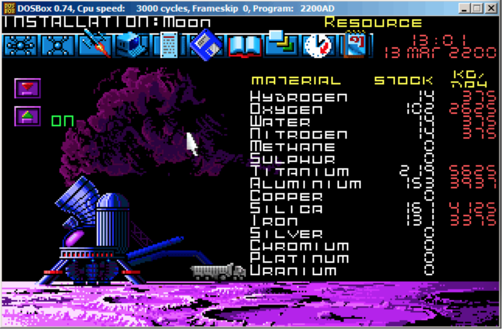
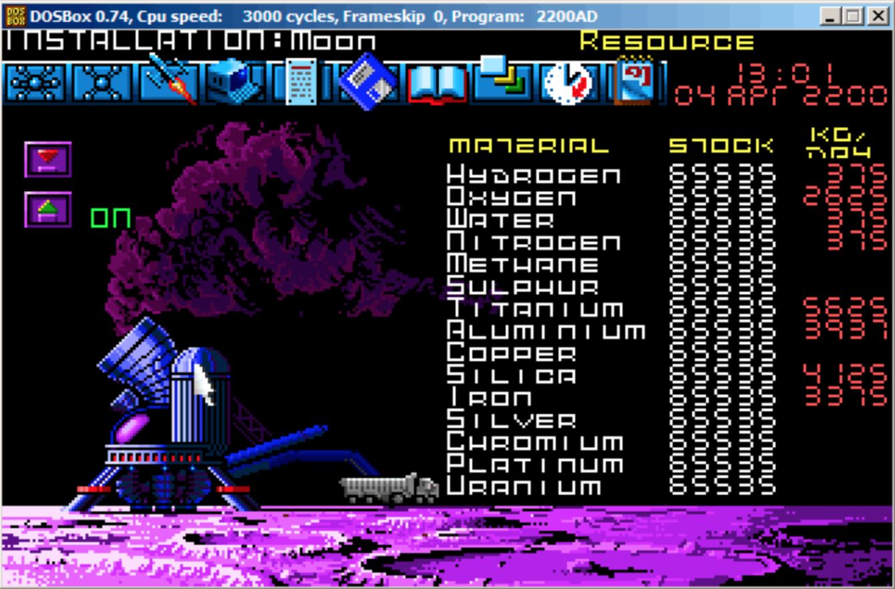
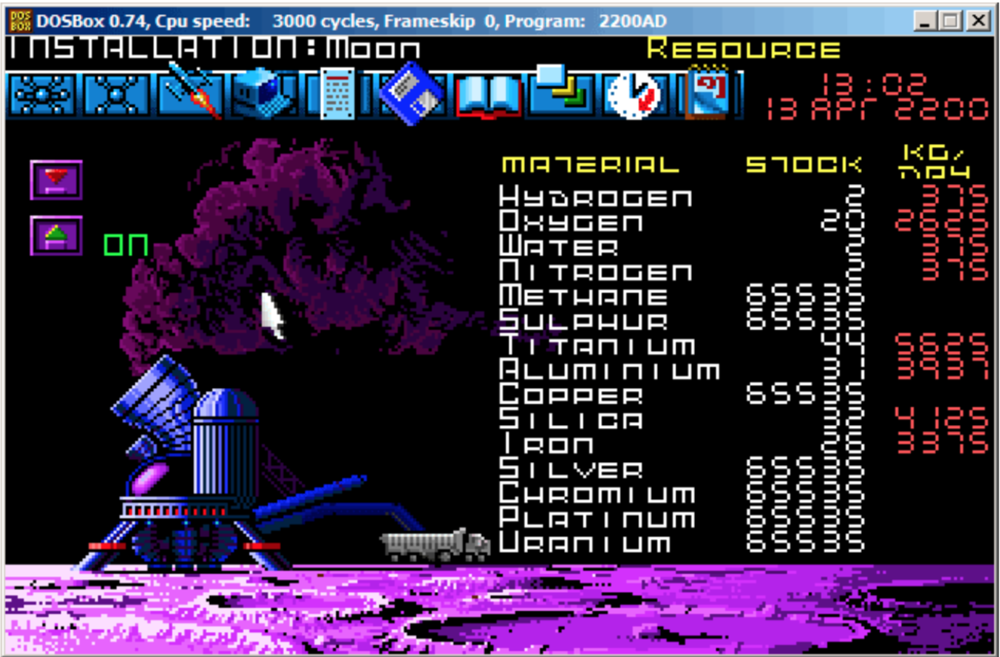

#第85章
##Millenium 游戏存档文件

"Millenium Return to Earth"是一款很老的DOS游戏(1991)，你可以挖掘矿产资源，修建船只，在其他星球上装备它们等等。

就像其他游戏一样，你可以将游戏状态存入一个文件中。

咱们来看看能不能找到点什么。

下面这是游戏中的一处矿井。有些星球的矿井工作更快，也有工作慢的。资源的设置也不同。来看看现在底下埋的是什么样的资源：



我保存了游戏状态。存档文件大小为9538字节。

我在游戏中等了"几天"，现在我们可以从矿井中得到更多的资源：


我再次保存了游戏状态。

下面我们使用简单的DOS/Windows FC 工具来比较二进制存档文件。

```
...> FC /b 2200save.i.v1 2200SAVE.I.V2

Comparing files 2200save.i.v1 and 2200SAVE.I.V2
00000016: 0D 04
00000017: 03 04
0000001C: 1F 1E
00000146: 27 3B
00000BDA: 0E 16
00000BDC: 66 9B
00000BDE: 0E 16
00000BE0: 0E 16
00000BE6: DB 4C
00000BE7: 00 01
00000BE8: 99 E8
00000BEC: A1 F3
00000BEE: 83 C7
00000BFB: A8 28
00000BFD: 98 18
00000BFF: A8 28
00000C01: A8 28
00000C07: D8 58
00000C09: E4 A4
00000C0D: 38 B8
00000C0F: E8 68

...
```
这里的输出并不完整，有许多不同之处，我截取了结果来展示最有趣的部分。

在第一个状态中，我有14个单位的氢气，102个单位的氧气。在第二个状态中则分别是22和155个单位。如果这些值保存到了存档文件中，我们会看到差异。的确如此，较老存档的0XBDA处的值为0x0E(14),而在新存档中则变成了0x16(22)。这可能是氢气。同样，老存档的0XBDC处的值为0x66(102)，新存档中值变为0x9B(155)。这看上去是氧气。我将两个文件都放在我的网站上，想要自己实验了解更多信息的请戳这里：[beginners.re](http://beginners.re/examples/millenium_DOS_game/)

下面是在Hiew中显示的新存档文件，我将游戏中与资源相关的值标记了出来：


我检查后确认它们是16-bit值，不是16-bit DOS软件中什么奇怪的东西，16-bit的DOS软件int类型为16比特。

下面来验证咱们的假设吧。我在第一个位置(氢气的位置)写入1234(0x4D2):


然后我加载这个已改变的文件到游戏中，查看矿井的数据：


这就对了。


现在我们尝试让这个游戏更快结束，把值设为最大：


0xFFFF就是65536，现在我们拥有了许多资源：



我在游戏中跳过了"几天"，结果有些资源变少了：



溢出发生了。游戏开发者可能没考虑到会出现这么多的资源的情况，没有设置溢出检查，但游戏中的矿井仍然在工作，资源在增加，所以导致了溢出。我想我不应该那么贪婪。

可能大量的数值都保存在了这个文件中。

这就是非常简单的游戏欺骗方法。高分文件可以通过这样打补丁轻松得到。

更多关于文件和内存快照的比对：63.4 第681页
