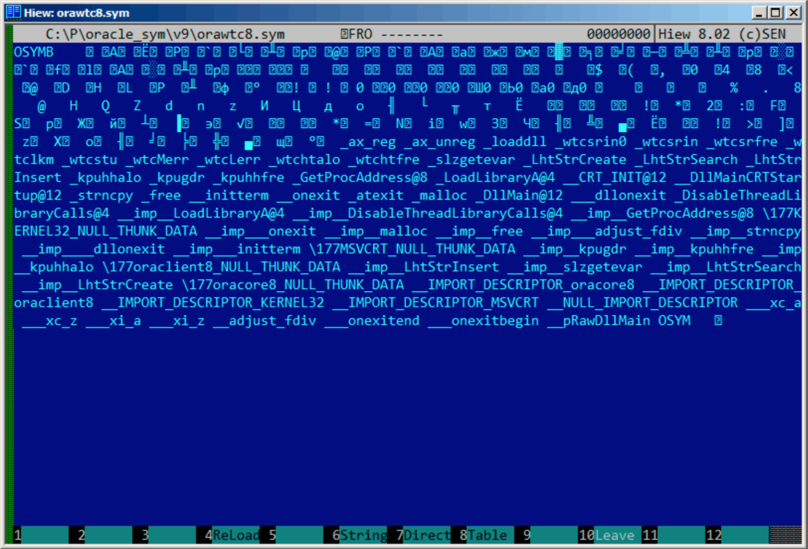

#第86章

##Oracle RDBMS: .SYM-files

当一个Oracle RDBMS进程出于某种原因崩溃时，会将许多信息写入日志文件，包括栈回溯，就像这样：

```
----- Call Stack Trace -----
calling				call    entry                	argument values in hex
location            type    point                	(? means dubious value)
------------------- -------- -------------------- 	----------------------------
_kqvrow()					00000000
_opifch2()+2729		CALLptr 00000000			  	23D4B914 E47F264 1F19AE2
													EB1C8A8 1
_kpoal8()+2832		CALLrel _opifch2()				89 5 EB1CC74
_opiodr()+1248		CALLreg 00000000				5E 1C EB1F0A0
_ttcpip()+1051		CALLreg 00000000				5E 1C EB1F0A0 0
_opitsk()+1404		CALL??? 00000000				C96C040 5E EB1F0A0 0 EB1ED30
													EB1F1CC 53E52E 0 EB1F1F8
_opiino()+980		CALLrel	_opitsk()				0   0
_opiodr()+1248		CALLreg	00000000				3C 4 EB1FBF4
_opidrv()+1201		CALLrel	_opiodr()				3C 4 EB1FBF4 0
_sou2o()+55			CALLrel	_opidrv()				3C 4 EB1FBF4
_opimai_real()+124	CALLrel	_opimai_real()			2 EB1FC2C
_OracleThreadStart@ CALLrel	_opimai()				2 EB1FF6C 7C88A7F4 EB1FC34 0
4()+830												EB1FD04
77E6481C			CALLreg 00000000				E41FF9C 0 0 E41FF9C 0 EB1FFC4
00000000			CALL??? 00000000
```

当然Oracle RDBMS 可执行文件肯定拥有某种调试信息,或者带有符号信息(或者类似信息)的映射文件。

WindowsNT Oracle RDBMS 的符号信息包含在具有.SYM扩展名的文件中，具有专门的格式。(平文文件挺好的，但是需要额外解析，因此获取速度更慢)

咱们来看看能不能理解它的格式。我选了最短的orawtc8.sym文件，来自于Oracle 8.1.7 版本orawtc8.dll 文件。

下面是Hiew加载后的效果：



通过与其他.SYN文件的对比，我们可以快速发现"OSYM"总是头(和尾)，因此这可能就是文件的标志。

同时也可以看出，文件格式是：OSYM+一些二进制数据+以0为界定符的字符串+OSYM。这些字符串显然是函数和全局变量名。

我标记了OSYM标志和字符串：


咱们来看看。我在Hiew中标记了整个字符串块(除了末尾的OSYM)，然后把它放进单独的文件中。然后我运行UNIX的strings和wc工具分析字符串

```
strings strings_block | wc -l
66
```
有66个文本字符串，请记住这个数字。

可以这么说，常规情况下，数量值会被存储在一个单独的二进制文件中。的确也是如此，我们可以在文件开头找到这个66数字(0x42)，就在OSYM这个标志右边：

```
$ hexdump -C orawtc8.sym
00000000  4f 53 59 4d 42 00 00 00  00 10 00 10 80 10 00 10  |OSYMB...........|
00000010  f0 10 00 10 50 11 00 10  60 11 00 10 c0 11 00 10  |....P...`.......|
00000020  d0 11 00 10 70 13 00 10  40 15 00 10 50 15 00 10  |....p...@...P...|
00000030  60 15 00 10 80 15 00 10  a0 15 00 10 a6 15 00 10  |`...............|
....
```

当然，这里的0x42不是一个字节，更像是一个32比特的值，小端，后面至少跟着3个0字节。

为什么我认为是32位呢？因为Oracle RDBMS的符号文件比较大。主要的oracle.exe可执行文件(10.2.0.4版本)的oracle.sym文件包含0x3A38E(238478)个符号。一个16位的值在这里明显不够。

我检查了其他.SYM文件，证实了我的猜想：OSYM符号后面的32位值总表示文件字符串的数量。

这对于所有的二进制文件来说几乎是通用的：文件头包含标志和文件其他信息。

现在我们来进一步调查二进制块是什么。再次使用Hiew，我把从块头8个字节(32位计数值后面)开始一直到字符串块结尾的内容放入单独的文件中。

在Hiew中看看这个二进制块：


有一个明显的规律。

我用红线划分了这个块：


Hiew,就像其他的十六进制编辑器一样，每行显示16个字节。所以规律很容易看出来：每行有4个32位的值。

这个规律容易看出来的原因是其中的一些值(地址0x104之前)总是具有0x1000xxxx的格式，以0x10和0字节开始。其他值(从地址0x108开始)都是0x0000xxxx的格式，总是以两个0字节开始。

我们把这个块当作32位值的数组dump出来：


```
$ od -v -t x4 binary_block
0000000 10001000 10001080 100010f0 10001150
0000020 10001160 100011c0 100011d0 10001370
0000040 10001540 10001550 10001560 10001580
0000060 100015a0 100015a6 100015ac 100015b2
0000100 100015b8 100015be 100015c4 100015ca
0000120 100015d0 100015e0 100016b0 10001760
0000140 10001766 1000176c 10001780 100017b0
0000160 100017d0 100017e0 10001810 10001816
0000200 10002000 10002004 10002008 1000200c
0000220 10002010 10002014 10002018 1000201c
0000240 10002020 10002024 10002028 1000202c
0000260 10002030 10002034 10002038 1000203c
0000300 10002040 10002044 10002048 1000204c
0000320 10002050 100020d0 100020e4 100020f8
0000340 1000210c 10002120 10003000 10003004
0000360 10003008 1000300c 10003098 1000309c
0000400 100030a0 100030a4 00000000 00000008
0000420 00000012 0000001b 00000025 0000002e
0000440 00000038 00000040 00000048 00000051

0000460 0000005a 00000064 0000006e 0000007a
0000500 00000088 00000096 000000a4 000000ae
0000520 000000b6 000000c0 000000d2 000000e2
0000540 000000f0 00000107 00000110 00000116
0000560 00000121 0000012a 00000132 0000013a
0000600 00000146 00000153 00000170 00000186
0000620 000001a9 000001c1 000001de 000001ed
0000640 000001fb 00000207 0000021b 0000022a
0000660 0000023d 0000024e 00000269 00000277
0000700 00000287 00000297 000002b6 000002ca
0000720 000002dc 000002f0 00000304 00000321
0000740 0000033e 0000035d 0000037a 00000395
0000760 000003ae 000003b6 000003be 000003c6
0001000 000003ce 000003dc 000003e9 000003f8
0001020

```
这里有132个值，也就是66*2。或许每一个符号有两个32位的值，或者有两个数组呢？咱们接着看。

从0x1000开始的值可能是地址。毕竟这是dll的.SYM文件，win32 DLL默认的基址是0x10000000，代码通常从0x10001000开始。

我用IDA打开orawtc8.dll文件时发现基址并不相同，不过没关系，第一个函数是：

```
.text:60351000 sub_60351000	proc near
.text:60351000
.text:60351000 arg_0		= dword ptr 8
.text:60351000 arg_4		= dword ptr 0Ch
.text:60351000 arg_8		= dword ptr 10Ch
.text:60351000
.text:60351000 				push 	ebp
.text:60351001				mov		ebp,esp
.text:60351003				mov		eax, dword_60353014
.text:60351008				cmp		eax, 0FFFFFFFFh
.text:6035100B				jnz		short loc_6035104F
.text:6035100D				mov		ecx, hModule
.text:60351013				xor		eax, eax
.text:60351015				cmp		ecx, 0FFFFFFFFh
.text:60351018				mov		dword_60353014, eax
.text:6035101D				jnz		short loc_60351031
.text:6035101F				call	sub_603510F0
.text:60351024				mov		ecx, eax
.text:60351026				mov		eax, dword_60353014
.text:6035102B				mov		hModule, ecx
.text:60351031
.text:60351031 loc_60351031:					; CODE XREF: sub_60351000+1D
.text:60351031 				test	ecx, ecx
.text:60351033				jbe		short loc_6035104F
.text:60351035				push	offset ProcName ; "ax_reg"
.text:6035103A				push	ecx             ; hModule
.text:6035103B				call	ds:GetProcAddress
...
```

哇，"ax_reg"字符串看起来很熟悉。它的确是字符串块的第一个字符串。所以函数名是"ax_reg"。

第二个函数是：


```
.text:60351080 sub_60351080		proc near
.text:60351080
.text:60351080 arg_0			= dword ptr  8
.text:60351080 arg_4			= dword ptr  0Ch
.text:60351080
.text:60351080					push    ebp
.text:60351081					mov     ebp, esp
.text:60351083					mov     eax, dword_60353018
.text:60351088					cmp     eax, 0FFFFFFFFh
.text:6035108B					jnz     short loc_603510CF
.text:6035108D					mov     ecx, hModule
.text:60351093					xor     eax, eax
.text:60351095					cmp     ecx, 0FFFFFFFFh
.text:60351098					mov     dword_60353018, eax
.text:6035109D					jnz     short loc_603510B1
.text:6035109F					call    sub_603510F0
.text:603510A4					mov     ecx, eax
.text:603510A6					mov     eax, dword_60353018
.text:603510AB  				mov     hModule, ecx
.text:603510B1
.text:603510B1 loc_603510B1:							 ; CODE XREF: sub_60351080+1D
.text:603510B1 					test    ecx, ecx
.text:603510B3					jbe     short loc_603510CF
.text:603510B5					push    offset aAx_unreg ; "ax_unreg"
.text:603510BA 					push    ecx              ; hModule
.text:603510BB					call    ds:GetProcAddress
...

```

"ax_unreg"字符串也是字符串块的第二个字符串！第二个函数的开始地址是0x60351080，二进制块的第二个值是10001080.因此就是这个地址，但对于DLL加上了默认基地址

现在可以快速的检查然后确定数组开始的66个值(也就是数组前一半)只是DLL中的函数地址，包括一些标签等等。那么另一半是什么呢？剩余的66个值都是以0x0000开始的，看上去范围是[0...0x3FB8]。并且他们看上去不像位域：序列的数量在增长。最后一个十六进制数字看上去是随机的。因此不像是地址(如果它是4字节，8字节，16字节则可除尽)

我们问问自己吧：Oracle RDBMS的开发者还会在文件中保存什么呢？随便猜猜：可能是文本字符串(函数名)的地址。可以迅速验证这一点，是的，每个数字代表的就是字符串在这个块中第一个字符的位置。

就是这样，完成了！

我写了一个工具将这些.SYM文件转换到IDA脚本中，然后我可以加载.IDC脚本，设置函数名：

```
#include <stdio.h>
#include <stdint.h>
#include <io.h>
#include <assert.h>
#include <malloc.h>
#include <fcntl.h>
#include <string.h>
int main (int argc, char *argv[])
{
        uint32_t sig, cnt, offset;
        uint32_t *d1, *d2;
        int     h, i, remain, file_len;
        char    *d3;
        uint32_t array_size_in_bytes;
        assert (argv[1]); // file name
        assert (argv[2]); // additional offset (if needed)
        // additional offset
        assert (sscanf (argv[2], "%X", &offset)==1);
        // get file length
        assert ((h=open (argv[1], _O_RDONLY | _O_BINARY, 0))!=-1);
        assert ((file_len=lseek (h, 0, SEEK_END))!=-1);
        assert (lseek (h, 0, SEEK_SET)!=-1);
        // read signature
        assert (read (h, &sig, 4)==4);
        // read count
        assert (read (h, &cnt, 4)==4);
        assert (sig==0x4D59534F); // OSYM
        // skip timedatestamp (for 11g)
        //_lseek (h, 4, 1);
        array_size_in_bytes=cnt*sizeof(uint32_t);
		// load symbol addresses array
		d1=(uint32_t*)malloc (array_size_in_bytes);
		assert (d1);
		assert (read (h, d1, array_size_in_bytes)==array_size_in_bytes);
		// load string offsets array
		d2=(uint32_t*)malloc (array_size_in_bytes);
		assert (d2);
		assert (read (h, d2, array_size_in_bytes)==array_size_in_bytes);
		// calculate strings block size
		remain=file_len-(8+4)-(cnt*8);
		// load strings block
		assert (d3=(char*)malloc (remain));
		assert (read (h, d3, remain)==remain);
		printf ("#include <idc.idc>\n\n");
		printf ("static main() {\n");
		for (i=0; i<cnt; i++)
        		printf ("\tMakeName(0x%08X, \"%s\");\n", offset + d1[i], &d3[d2[i]]);
		printf ("}\n");
		close (h);
		free (d1); free (d2); free (d3);
```

下面是它工作的一个例子：

```
#include <idc.idc>
static main() {
	MakeName(0x60351000, "_ax_reg");
	MakeName(0x60351080, "_ax_unreg");
	MakeName(0x603510F0, "_loaddll");
	MakeName(0x60351150, "_wtcsrin0");
	MakeName(0x60351160, "_wtcsrin");
	MakeName(0x603511C0, "_wtcsrfre");
	MakeName(0x603511D0, "_wtclkm");
	MakeName(0x60351370, "_wtcstu");
... }
```

我使用的例子可以在这里找到：[beginners.re](http://go.yurichev.com/17216)

咱们来试试64位的Oracle RDBMS。相应的，地址应该为64位，对么？

8字节的规律看上去更加明显了：


是的，所有的表含有64位的元素，甚至是字符串的偏移。现在标志也变成了OSYMAM64，猜测是用于区分目标平台的。

就是这样了。连接Oracle RDBMS-SYM文件我用的函数的库：[GitHub](https://github.com/dennis714/porg/blob/master/oracle_sym.c)


 


