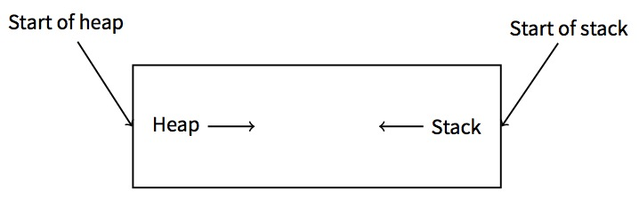
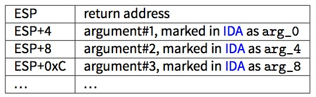
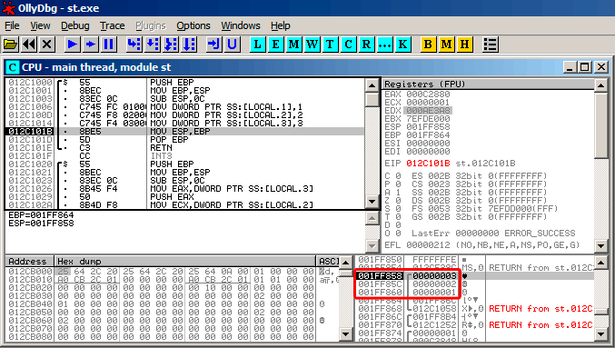

# 第五章
# 栈


栈是计算机科学中最基本的一种数据结构。

从技术上讲,栈只是在**x86**中被`ESP`寄存器、**x64**中被`RSP`寄存器、或**ARM**中被`SP`寄存器指向的一块程序内存。

在x86和ARM Thumb模式中，访问栈最常用的指令是`PUSH`和`POP`。`PUSH`指令在32位模式下,会将`ESP/RSP/SP`的值减去4(在64位系统中,会减去8),然后将它唯一的参数写入到`ESP/RSP/SP`指向的内存地址。

`POP`是`PUSH`的逆向操作:从`SP`指向的内存地址中获取数据,然后存入指定的参数中(一般为寄存器), 然后将栈指针加4(或8)。

在栈分配过后，栈指针指向栈底。`PUSH`减少栈指针；`POP`指令增加栈指针。栈底实际上是栈分配到的内存的起始地址。这看起来很奇怪，但事实就是这样。

ARM 支持递增堆栈和递减堆栈。

举几个例子：`STMFD/LDMFD`, `STMED/LDMED` 指令是用来处理递减堆栈的(向下增长，从高址开始向低址增长)。`STMFA/LDMFA`, `STMEA/LDMEA`指令是用来处理递增堆栈的(向上增长，从低址开始向高址增长)。


## 5.1 为什么栈会反向增长?

从直觉上来说,我们会认为栈像其它数据结构一样,是向高地址正向增长的。

栈反向增长是有历史原因的。在计算机十分巨大，需要占据整个房间的年代，人们可以很容易的把内存分为两部分，一部分给堆，另一部分给栈。当然，在程序运行期间，我们并不知道堆栈各需要多大的空间。这时最简单的解决方法可能是：


在[RT74]中我们可以看到:

> 映像文件的用户核心部分可以被划分为三个逻辑段。程序代码段在虚拟内存里从0位置开始。
> 在程序运行过程中,这部分是具有写保护的,同一程序的所有进程都共享代码段的一个副本。
> 在虚拟内存地址中,程序代码段开始的8k字节，是私有的的可写数据段,这个段的大小可以通过系统调用来扩大。
> 从虚拟内存的高位地址开始是堆栈段，这部分像硬件栈指针大小的变动一样，可以自动的向下增长。

以上可以使我们联想到：一些学生在一个笔记本中写两门课的笔记：将第一门课的笔记正常写下，由于厌恶，而把另一门的笔记从后往前写。两种笔记有可能因缺少空间，而在中间的某处相遇。


## 5.2 栈可以用来做什么?
### 5.2.1 保存函数的返回地址
#### x86

当使用`CALL`指令去调用一个函数时,`CALL`后面一条指令的地址会被保存到栈中,然后使用无条件跳转指令跳转到`CALL`中执行。

`CALL`指令等价于`PUSH address_after_call / JMP operand`这对指令。

`RET`指令从栈中取出一个值并转跳到这个值上，这等价于`POP tmp / JMP tmp`指令对。

栈溢出是很容易的。只需要执行无止尽的递归。
```
void f()
{
    	f();
};
```

MSVC 2008报告了这个问题:
```
c:\tmp6>cl ss.cpp /Fass.asm
Microsoft (R) 32-bit C/C++ Optimizing Compiler Version 15.00.21022.08 for 80x86
Copyright (C) Microsoft Corporation.  All rights reserved.

ss.cpp
c:\tmp6\ss.cpp(4) : warning C4717: ’f’ : recursive on all control paths, function will cause ⤦
    Ç runtime stack overflow
```

...但它还是生成了正确的代码:
```
?f@@YAXXZ PROC                      ; f
; File c:\tmp6\ss.cpp
; Line 2
        push 	ebp
        mov     ebp, esp
; Line 3
        call    ?f@@YAXXZ           ; f
; Line 4
        pop 	ebp
        ret     0
?f@@YAXXZ ENDP  					; f
```

...如果我们设置优化标识(`/0x`),优化过的代码将不会出现栈溢出,并且会*正确的*运行的。（此处为反讽）
```
?f@@YAXXZ PROC                      ; f
; File c:\tmp6\ss.cpp
; Line 2
$LL3@f:
; Line 3
        jmp     SHORT $LL3@f
?f@@YAXXZ ENDP                    	; f
```

GCC 4.4.1 在这两种条件下,会生成同样的代码,并且不会有任何警告。

#### ARM

ARM程序员也使用栈来保存返回地址,但稍有不同。正如我们在“Hello,World!(3.4)里提到过的, `RA`被保存在`LR`(链接寄存器)中。然而,如果有时需要调用另外一个函数,并且要多次使用`LR`寄存器,它的值必须被保存起来。通常它会在被保存到函数的开头。像我们经常看到的指令`PUSH R4-R7, LR`,与在函数结尾处的指令`POP R4-R7, PC`,在函数中使用到的寄存器的值，包括`LR`，会被保存到栈中。

然而,如果一个函数从未调用其它函数,它在`RISC`术语中被叫作叶子函数。因此,叶子函数不需要保存`LR`寄存器(因为他们并不修改它)。如果这样的函数很小，并只使用了少量的寄存器,它可能完全不需要用到栈。因此,可以不使用栈而调用叶子函数。这样做比在老x86机器上运行要快，因为不需要为栈留出额外的内存。在留给栈的内存尚未分配或不可用的情况下,这种方式是非常有用的。

一些叶子函数的例子：8.3.2 , 8.3.3 , 19.17 , 19.33 , 19.5.4 , 15.4 , 15.2 , 17.3 。

### 5.2.2 传递函数参数

在x86中,最常见的传参方式是`cdecl`:
```
push arg3
push arg2
push arg1
call f
add esp, 12 ; 4*3=12
```

被调用函数通过栈指针得到参数。

因此,以下就是在函数f()的第一条指令执行之前，栈中参数的值是如何排列的。


关于对调用约定参见(64)。值得注意的是，没有任何东西强迫程序员一定要使用栈来传递参数。这并不是必需的,一个程序员完全可以不使用栈,而通过其它方式来实现参数传递。

例如,可以为参数分配一部分堆空间,存入参数,然后通过`EAX`寄存器里指向这个块的指针，将参数传递给函数。这样是可行的。然而,在**x86**和**ARM**中,使用栈传递参数还是更加方便的。

另外,被调函数并不知道有多少参数被传递进来。C语言中有些函数可以传递不同个数的参数(如:`printf()`),他们一般通过使用格式字符串(以`%`开始)来判断参数个数。

如果我们可以这样些：
`printf("%d %d %d", 1234);`

printf()会输出入1234,然后另外输出和栈相邻的,两个另外的随机数字。

这就是为什么我们如何声明`main()`函数是不重要的,像`main()`,`main(int argc, char *argv[])`或`main(int argc, char *argv[], char *envp[])`。

事实上,`CRT 模式`大致是这样调用main()函数的： 
```
push envp 
push argv 
push argc 
call main 
...
```

即使你将`main()`声明为不带参数的main()函数。它们仍然在栈中,只是没被使用。如果你将`main()`声明为`main(int argc, char *argv[])`,你就可以使用前两个参数,并且第三个参数在你的函数仍然是"不可见的"。还有，如果你声明为`main(int argc)`这样,它同样是可以正常运行的。


### 5.2.3 存放局部变量

一个函数可以在栈中分配空间，用于储存局部变量。这只需要将栈指针向栈底增加。因此，无论你需要定义多少局部变量，这样都很快。

在栈中存放局部变量并不是一个硬性的要求。你可以将局部变量存到任何你想存的地方,但从传统上来说,大家更喜欢这样做。

### 5.2.4 x86: alloca() 函数

这里值得注意的是`alloca()`函数。该函数的作用类似于`malloc()`,但它会直接在栈上分配内存。

它分配的内存块，并不需要调用像`free()`这样的函数来释放(4)。当函数运行结束,`ESP`的值还原时,这部分内存会自动释放。

值得注意的是`alloca()`函数的实现。简而言之,这个函数就是根据你所需要的内存大小，将`ESP`指针指向栈底移位,然后将`ESP`指向所分配的内存块。

让我们试一下:
```
#ifdef __GNUC__
#include <alloca.h> // GCC
#else
#include <malloc.h> // MSVC
#endif
#include <stdio.h>

void f()
{
	char *buf=(char*)alloca (600);
#ifdef __GNUC__
	snprintf (buf, 600, "hi! %d, %d, %d\n", 1, 2, 3); // GCC
#else
	_snprintf (buf, 600, "hi! %d, %d, %d\n", 1, 2, 3); // MSVC
#endif

	puts (buf);
};
```

`_snprintf()`函数作用与`printf()`函数基本相同,不同的地方是`printf()`会将结果输出到的标准输出中(例如：终端和控制台),`_snprintf()`会将结果保存到缓冲区中,`puts()`会将缓冲区的内容复制到标准输出。当然，后面两行代码可以使只用一个`printf()`调用替换,但我们必须说明小缓冲区的用途。

#### MSVC

让我们来编译 (MSVC 2010):

代码清单 5.1: MSVC 2010

```
...

        mov    eax, 600         ; 00000258H
        call   __alloca_probe_16
        mov    esi, esp
 
        push   3
        push   2
        push   1
        push   OFFSET $SG2672
        push   600              ; 00000258H
        push   esi
        call   __snprintf
 
        push   esi
        call   _puts
        add    esp, 28          ; 0000001cH

...
```

`alloca()`的唯一一个参数通过`EAX`来传递(而不是把他压入栈)。在函数调用结束时,`ESP`会指向 600字节的内存,我们可以像使用缓冲区数组一样来使用它。

#### GCC + Intel格式

GCC 4.4.1不需要调用额外的函数，就可以实现相同的功能:

代码清单 5.2: GCC 4.7.3
```
.LC0:
		.string "hi! %d, %d, %d\n"
f:
		push 	ebp
		mov 	ebp, esp
		push 	ebx
		sub 	esp, 660
		lea 	ebx, [esp+39]
		and 	ebx, -16 							; align pointer by 16-bit border
		mov 	DWORD PTR [esp], ebx 				; s
		mov 	DWORD PTR [esp+20], 3
		mov 	DWORD PTR [esp+16], 2
		mov 	DWORD PTR [esp+12], 1
		mov 	DWORD PTR [esp+8], OFFSET FLAT:.LC0 ; "hi! %d, %d, %d\n"
		mov 	DWORD PTR [esp+4], 600 				; maxlen
		call 	_snprintf
		mov 	DWORD PTR [esp], ebx 				; s
		call 	puts
		mov 	ebx, DWORD PTR [ebp-4]
		leave
		ret
```

#### GCC + AT&T 语法

我们来看看使用了AT&T语法的相同的代码:

代码清单 5.3: GCC 4.7.3
```
.LC0:
        .string "hi! %d, %d, %d\n"
f:
        pushl 	%ebp
        movl    %esp, %ebp
        pushl   %ebx
        subl    $660, %esp
        leal    39(%esp), %ebx
        andl    $-16, %ebx
        movl    %ebx, (%esp)
        movl    $3, 20(%esp)
        movl    $2, 16(%esp)
        movl    $1, 12(%esp)
        movl    $.LC0, 8(%esp)
        movl    $600, 4(%esp)
        call    _snprintf
        movl    %ebx, (%esp)
        call    puts
        movl    -4(%ebp), %ebx
        leave
        ret
```

这里的代码与上面的那个代码清单是相同的。

另外:在Intel语法中，`movl $3, 20(%esp)`与`mov DWORD PTR [esp + 20],3`是等价的。在AT&T语法中，register+offset形式的内存地址表示为：`offset(%register)`。

### 5.2.5 (Windows) 结构化异常处理 (SEH)

(如果存在)`SEH`记录也是存放在栈中的。 
想了解更多，参看(68.3)。

### 5.2.6 缓冲区溢出保护

想了解更多，参看(18.2)。

### 5.2.7 栈内数据的自动回收

也许把临时变量和`SHE`记录存在栈中，是因为他们会在函数的结尾会被自动的释放，而且只需要用一条指令就能还原栈指针(通常是`ADD`)。函数的参数也会在函数的结尾被释放。相对的，储存在堆中的任何东西都必须被明确的释放。

## 5.3 典型的堆栈布局

以下是32位的环境中，第一个函数开始执行前，栈典型的布局:


## 5.4 栈内的'噪声'

在这本书里，我们经常提到栈中的"噪声"值和内存中的"垃圾"值，他们从哪里来？他们通常是上一个函数执行完而留下的值。简短的例子：
```
#include <stdio.h>

void f1()
{
		int a=1, b=2, c=3;
};
void f2()
{
		int a, b, c;
		printf ("%d, %d, %d\n", a, b, c);
};
int main()
{
		f1();
		f2();
};
```

编译后：

代码清单 5.4: 无优化的 MSVC 2010
```
$SG2752 DB 		'%d, %d, %d', 0aH, 00H

_c$ = -12 		; size = 4
_b$ = -8 		; size = 4
_a$ = -4 		; size = 4
_f1 	PROC
		push 	ebp
		mov 	ebp, esp
		sub 	esp, 12
		mov 	DWORD PTR _a$[ebp], 1
		mov 	DWORD PTR _b$[ebp], 2
		mov 	DWORD PTR _c$[ebp], 3
		mov 	esp, ebp
		pop 	ebp
		ret 	0
_f1 	ENDP

_c$ = -12 		; size = 4
_b$ = -8 		; size = 4
_a$ = -4 		; size = 4
_f2 	PROC
		push 	ebp
		mov 	ebp, esp
		sub 	esp, 12
		mov 	eax, DWORD PTR _c$[ebp]
		push 	eax
		mov 	ecx, DWORD PTR _b$[ebp]
		push 	ecx
		mov 	edx, DWORD PTR _a$[ebp]
		push 	edx
		push 	OFFSET $SG2752 ; '%d, %d, %d'
		call 	DWORD PTR __imp__printf
		add 	esp, 16
		mov 	esp, ebp
		pop 	ebp
		ret 	0
_f2 ENDP

_main 	PROC
		push 	ebp
		mov 	ebp, esp
		call	_f1
		call 	_f2
		xor 	eax, eax
		pop 	ebp
		ret 	0
_main ENDP
```

编译器会有一些小怨言：
```
c:\Polygon\c>cl st.c /Fast.asm /MD
Microsoft (R) 32-bit C/C++ Optimizing Compiler Version 16.00.40219.01 for 80x86
Copyright (C) Microsoft Corporation. All rights reserved.

st.c
c:\polygon\c\st.c(11) : warning C4700: uninitialized local variable 'c' used
c:\polygon\c\st.c(11) : warning C4700: uninitialized local variable 'b' used
c:\polygon\c\st.c(11) : warning C4700: uninitialized local variable 'a' used
Microsoft (R) Incremental Linker Version 10.00.40219.01
Copyright (C) Microsoft Corporation. All rights reserved.

/out:st.exe
st.obj
```

但当我们运行编译好的程序时：
```
c:\Polygon\c>st
1, 2, 3
```

啊！这太奇怪了！在`f2()`里，我们并没有为任何变量赋值。这些幽灵般的值仍留在栈里。

让我们在OllyDbg里加载这个例子：



图 5.1: OllyDbg: f1()


当`f1()`分配变量a、b和c时，他们的值被存到`0x1FF860`等几个地址里。

然后当`f2()`执行的时候：


图 5.2: OllyDbg: f2()


...`f2()`中的a、b和c分到了相同的地址！并且没有一个值被覆盖了，到目前为止他们的值未受影响。

为了让这中情况发生，一定有几个函数被依次调用，并且在每个函数分支中`SP`都有相同的值(例如，他们都有相同的参数)。然后这些临时变量就会被分配到栈中相同的位置上。

总的来说，栈中(和内存中)所有的值中总有几个，是先前的函数执行后留下的。严格的来说他们并不是随机的，但是他们的值是不可预测的。

还有其他可能吗？也许可以在每个函数执行完后，清除栈中一部分的值，但这会产生很多额外的(而且没必要的)工作。


### 5.4.1 MSVC 2013

这个例子是在MSVC 2010里编译的。但有些读者会尝试在MSVC 2013 里编译、运行它。然后会得到三个数字颠倒后的结果：
```
c:\Polygon\c>st
3, 2, 1
```

为什么？

我也在MSVC 2013中编译了这个程序：

代码清单 5.5: MSVC 2013
```
_a$ = -12 		; size = 4
_b$ = -8 		; size = 4
_c$ = -4 		; size = 4
_f2 PROC

...

_f2 ENDP

_c$ = -12 		; size = 4
_b$ = -8 		; size = 4
_a$ = -4 		; size = 4
_f1 PROC

...

_f1 ENDP
```

不像MSVC 2010 ，在MSVC 2013中`f2()`中的变量`a/b/c`会被以相反的顺序分配空间。但这样做是完全正确的，因为C/C++标准里并没有规定要以何种顺序来分配栈中的变量。产生这个区别的原因是：MSVC 2010有他自己的分配变量的方式，而在MSVC 2013中，可能有什么事改变了编译器内在的东西，所以结果稍有区别。


## 5.5 Exercises

* http://challenges.re/51
* http://challenges.re/52