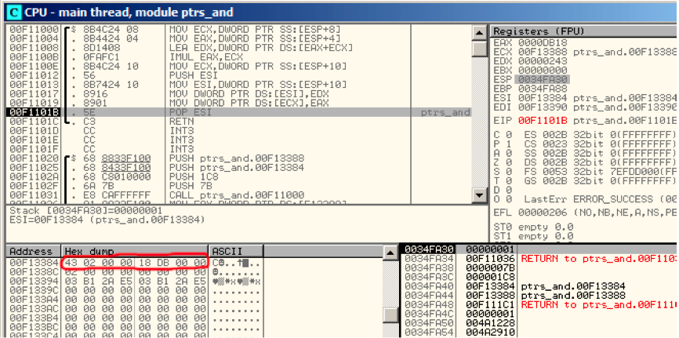
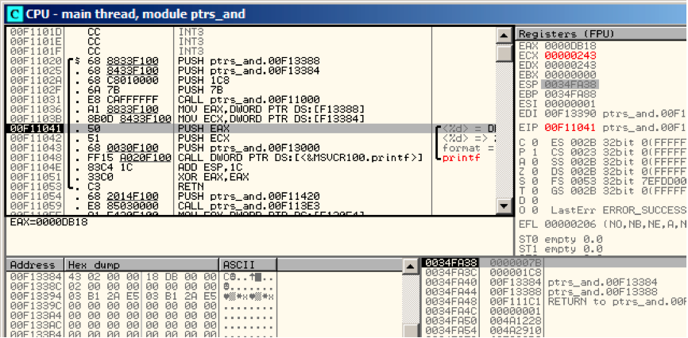
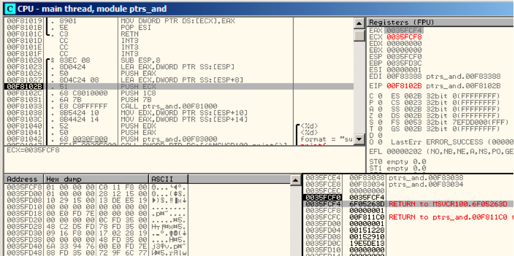

# 第十章
# 指针
指针通常被用作函数返回值(recall scanf() case (6)).例如，当函数返回两个值时。

## 10.1 Global variables example

```
#include <stdio.h>

void f1 (int x, int y, int *sum, int *product)
{
    *sum=x+y;
    *product=x*y;
};

int sum, product;

void main()
{
    f1(123, 456, &sum, &product);
    printf ("sum=%d, product=%d", sum, product);
};
```

编译后

Listing 10.1: Optimizing MSVC 2010 (/Ox /Ob0)

```
COMM        _product:DWORD
COMM        _sum:DWORD
$SG2803 DB              ’sum=%d, product=%d’, 0aH, 00H
 
_x$ = 8                                     ; size = 4
_y$ = 12                                    ; size = 4
_sum$ = 16                                  ; size = 4
_product$ = 20                              ; size = 4
_f1         PROC
            mov     ecx, DWORD PTR _y$[esp-4]
            mov     eax, DWORD PTR _x$[esp-4]
            lea     edx, DWORD PTR [eax+ecx]
            imul    eax, ecx
            mov     ecx, DWORD PTR _product$[esp-4]
            push    esi
            mov     esi, DWORD PTR _sum$[esp]
            mov     DWORD PTR [esi], edx
            mov     DWORD PTR [ecx], eax
            pop     esi
            ret     0
_f1         ENDP
 
_main       PROC
            push    OFFSET _product
            push    OFFSET _sum
            push    456                     ; 000001c8H
            push    123                     ; 0000007bH
            call    _f1
            mov     eax, DWORD PTR _product
            mov     ecx, DWORD PTR _sum
            push    eax
            push    ecx
            push    OFFSET $SG2803
            call    DWORD PTR __imp__printf
            add     esp, 28                 ; 0000001cH
            xor     eax, eax
            ret     0
_main   ENDP
```

让我们在OD中查看：图9.1。首先全局变量地址被传递进f1()。我们在堆栈元素点击“数据窗口跟随”，可以看到数据段上分配两个变量的空间。这些变量被置0，因为未初始化数据（BSS1）在程序运行之前被清理为0。这些变量属于数据段，我们按Alt+M可以查看内存映射fig. 9.5.

让我们跟踪（F7）到f1()fig. 9.2.在堆栈中为456 (0x1C8) 和 123 (0x7B)，接着是两个全局变量的地址。

让我们跟踪到f1()结尾，可以看到两个全局变量存放了计算结果。

现在两个全局变量的值被加载到寄存器传递给printf(): fig. 10.4.


Figure 10.1: OllyDbg: 全局变量地址被传递进f1()


Figure 10.2: OllyDbg: f1()开始



Figure 10.3: OllyDbg: f1()完成



Figure 10.4: OllyDbg: 全局变量被传递进printf()


Figure 10.5: OllyDbg: memory map

## 10.2 Local variables example

让我们修改一下例子：

Listing 10.2: 局部变量

```
void main()
{
    int sum, product; // now variables are here
 
    f1(123, 456, &sum, &product);
    printf ("sum=%d, product=%d
", sum, product);
};
```

f1()函数代码没有改变。仅仅main()代码作了修改。

Listing 10.3: Optimizing MSVC 2010 (/Ox /Ob0)

```
_product$ = -8              ; size = 4
_sum$ = -4                  ; size = 4
_main   PROC
; Line 10
        sub     esp, 8
; Line 13
        lea     eax, DWORD PTR _product$[esp+8]
        push    eax
        lea     ecx, DWORD PTR _sum$[esp+12]
        push    ecx
        push    456         ; 000001c8H
        push    123         ; 0000007bH
        call    _f1
; Line 14
        mov     edx, DWORD PTR _product$[esp+24]
        mov     eax, DWORD PTR _sum$[esp+24]
        push    edx
        push    eax
        push    OFFSET $SG2803
        call    DWORD PTR __imp__printf
; Line 15
        xor     eax, eax
        add     esp, 36     ; 00000024H
        ret     0
```

我们在OD中查看，局部变量地址在堆栈中是0x35FCF4和0x35FCF8。我们可以看到是如何圧栈的fig. 10.6.

f1()开始的时候，随机栈地址为0x35FCF4和0x35FCF8 fig. 10.7.

f1()完成时结果0xDB18和0x243存放在地址0x35FCF4和0x35FCF8。



Figure 10.6: OllyDbg: 局部变量地址被圧栈


Figure 10.7: OllyDbg: f1()starting


Figure 10.8: OllyDbg: f1()finished

## 10.3 小结

f1()可以返回结果到内存的任何地方，这是指针的本质和特性。顺便提一下，C++引用的工作方式和这个类似。详情阅读相关内容（33）。