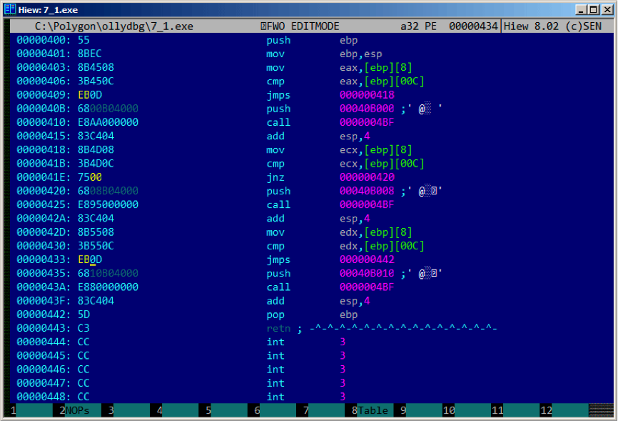

# 第十二章 
# 条件跳转

## 12.1 简单的例子

现在我们来了解条件跳转。

```
#include <stdio.h>

void f_signed (int a, int b)
{
    if (a>b)
        printf ("a>b");
    if (a==b)
        printf ("a==b");
    if (a<b)
        printf ("a<b");
};

void f_unsigned (unsigned int a, unsigned int b)
{
    if (a>b)
        printf ("a>b");
    if (a==b)
        printf ("a==b");
    if (a<b)
        printf ("a<b");
};

int main()
{
    f_signed(1, 2);
    f_unsigned(1, 2);
    return 0;
};
```

### 12.1.1 x86

#### x86 + MSVC

f_signed() 函数:

Listing 12.1: 非优化MSVC 2010

```
_a$ = 8
_b$ = 12
_f_signed   PROC
        push    ebp
        mov     ebp, esp
        mov     eax, DWORD PTR _a$[ebp]
        cmp     eax, DWORD PTR _b$[ebp]
        jle     SHORT $LN3@f_signed
        push    OFFSET $SG737       ; ’a>b’
        call    _printf
        add     esp, 4
$LN3@f_signed:
        mov     ecx, DWORD PTR _a$[ebp]
        cmp     ecx, DWORD PTR _b$[ebp]
        jne     SHORT $LN2@f_signed
        push    OFFSET $SG739       ; ’a==b’
        call    _printf
        add     esp, 4
$LN2@f_signed:
        mov     edx, DWORD PTR _a$[ebp]
        cmp     edx, DWORD PTR _b$[ebp]
        jge     SHORT $LN4@f_signed
        push    OFFSET $SG741       ; ’a<b’
        call    _printf
        add     esp, 4
        $LN4@f_signed:
        pop     ebp
        ret     0
_f_signed   ENDP
```

第一个指令JLE意味如果小于等于则跳转。换句话说，第二个操作数大于或者等于第一个操作数，控制流将传递到指定地址或者标签。否则（第二个操作数小于第一个操作数）第一个printf()将被调用。第二个检测JNE：如果不相等则跳转。如果两个操作数相等控制流则不变。第三个检测JGE：大于等于跳转，当第一个操作数大于或者等于第二个操作数时跳转。如果三种情况都没有发生则无printf()被调用，事实上，如果没有特殊干预，这种情况几乎不会发生。

f_unsigned()函数类似，只是JBE和JAE替代了JLE和JGE，我们来看f_unsigned()函数

Listing 12.2: GCC

```
_a$ = 8                                 ; size = 4
_b$ = 12                                ; size = 4
_f_unsigned     PROC
        push    ebp
        mov     ebp, esp
        mov     eax, DWORD PTR _a$[ebp]
        cmp     eax, DWORD PTR _b$[ebp]
        jbe     SHORT $LN3@f_unsigned
        push    OFFSET $SG2761 ; ’a>b’
        call    _printf
        add     esp, 4
$LN3@f_unsigned:
        mov     ecx, DWORD PTR _a$[ebp]
        cmp     ecx, DWORD PTR _b$[ebp]
        jne     SHORT $LN2@f_unsigned
        push    OFFSET $SG2763 ; ’a==b’
        call    _printf
        add     esp, 4
$LN2@f_unsigned:
        mov     edx, DWORD PTR _a$[ebp]
        cmp     edx, DWORD PTR _b$[ebp]
        jae     SHORT $LN4@f_unsigned
        push    OFFSET $SG2765 ; ’a<b’
        call    _printf
        add     esp, 4
$LN4@f_unsigned:
        pop     ebp
        ret     0
_f_unsigned     ENDP
```

几乎是相同的，不同的是：JBE-小于等于跳转和JAE-大于等于跳转。这些指令(JA/JAE/JBE/JBE)不同于JG/JGE/JL/JLE，它们使用无符号值。

我们也可以看到有符号值的表示(35)。因此我们看JG/JL代替JA/JBE的用法或者相反，我们几乎可以确定变量的有符号或者无符号类型。

main()函数没有什么新的内容：

Listing 12.3: main()

```
_main   PROC
        push    ebp
        mov     ebp, esp
        push    2
        push    1
        call    _f_signed
        add     esp, 8
        push    2
        push    1
        call    _f_unsigned
        add     esp, 8
        xor     eax, eax
        pop     ebp
        ret     0
_main   ENDP
```

### 10.1.2 x86 + MSVC + OllyDbg

我们在OD里允许例子来查看标志寄存器。我们从f_unsigned()函数开始。CMP执行了三次，每次的参数都相同，所以标志位也相同。

第一次比较的结果：fig. 12.1.标志位：C=1, P=1, A=1, Z=0, S=1, T=0, D=0, O=0.标志位名称为OD对其的简称。

当CF=1 or ZF=1时JBE将被触发，此时将跳转。

接下来的条件跳转：fig. 12.2.当ZF=0（zero flag）时JNZ则被触发

第三个条件跳转：fig. 12.3.我们可以发现14当CF=0 (carry flag)时，JNB将被触发。在该例中条件不为真，所以第三个printf()将被执行。


Figure 12.1: OllyDbg: f_unsigned(): 第一个条件跳转


Figure 12.2: OllyDbg: f_unsigned(): 第二个条件跳转


Figure 12.3: OllyDbg: f_unsigned(): 第三个条件跳转

现在我们在OD中看f_signed()函数使用有符号值。

可以看到标志寄存器：C=1, P=1, A=1, Z=0, S=1, T=0, D=0, O=0.

第一种条件跳转JLE将被触发fig. 12.4.我们可以发现14，当ZF=1 or SF≠OF。该例中SF≠OF，所以跳转将被触发。

下一个条件跳转将被触发：如果ZF=0 (zero flag): fig. 12.5.

第三个条件跳转将不会被触发，因为仅有SF=OF，该例中不为真: fig. 12.6.


Figure 12.4: OllyDbg: f_signed(): 第一个条件跳转


Figure 12.5: OllyDbg: f_signed(): 第二个条件跳转


Figure 12.6: OllyDbg: f_signed(): 第三个条件跳转

#### x86 + MSVC + Hiew

我们可以修改这个可执行文件，使其无论输入的什么值f_unsigned()函数都会打印“a==b”。

在Hiew中查看：fig. 12.7.

我们要完成以下3个任务：

1. 使第一个跳转一直被触发；
2. 使第二个跳转从不被触发；
3. 使第三个跳转一直被触发。
我们需要使代码流进入第二个printf()，这样才一直打印“a==b”。

三个指令（或字节）应该被修改：

1. 第一个跳转修改为JMP，但跳转偏移值不变。
2. 第二个跳转有时可能被触发，我们修改跳转偏移值为0后，无论何种情况，程序总是跳向下一条指令。跳转地址等于跳转偏移值加上下一条指令地址，当跳转偏移值为0时，跳转地址就为下一条指令地址，所以无论如何下一条指令总被执行。
3. 第三个跳转我们也修改为JMP，这样跳转总被触发。
修改后：fig. 12.8.

如果忘了这些跳转，printf()可能会被多次调用，这种行为可能是我们不需要的。


Figure 12.7: Hiew: f_unsigned() 函数



Figure 12.8: Hiew:我们修改 f_unsigned() 函数

#### Non-optimizing GCC

GCC 4.4.1非优化状态产生的代码几乎一样，只是用puts() (2.3.3) 替代 printf()。

12.1.5 Optimizing GCC

细心的读者可能会问，为什么要多次执行CMP，如果标志寄存器每次都相同呢？可能MSVC不会做这样的优化，但是GCC 4.8.1可以做这样的深度优化：

Listing 12.4: GCC 4.8.1 f_signed()

```
f_signed:
        mov     eax, DWORD PTR [esp+8]
        cmp     DWORD PTR [esp+4], eax
        jg      .L6
        je      .L7
        jge     .L1
        mov     DWORD PTR [esp+4], OFFSET FLAT:.LC2 ; "a<b"
        jmp     puts
.L6:
        mov     DWORD PTR [esp+4], OFFSET FLAT:.LC0 ; "a>b"
        jmp     puts
.L1:
        rep     ret
.L7:
        mov     DWORD PTR [esp+4], OFFSET FLAT:.LC1 ; "a==b"
        jmp     puts
```

我们可以看到JMP puts替代了CALL puts/RETN。稍后我们介绍这种情况11.1.1.。

不用说，这种类型的x86代码是很少见的。MSVC2012似乎不会这样做。其他情况下，汇编程序能意识到此类使用。如果你在其它地方看到此类代码，更可能是手工构造的。

f_unsigned()函数代码：

Listing 12.5: GCC 4.8.1 f_unsigned()

```
f_unsigned:
        push    esi
        push    ebx
        sub     esp, 20
        mov     esi, DWORD PTR [esp+32]
        mov     ebx, DWORD PTR [esp+36]
        cmp     esi, ebx
        ja      .L13
        cmp     esi, ebx ; instruction may be removed
        je      .L14
.L10:
        jb      .L15
        add     esp, 20
        pop     ebx
        pop     esi
        ret
.L15:
        mov     DWORD PTR [esp+32], OFFSET FLAT:.LC2 ; "a<b"
        add     esp, 20
        pop     ebx
        pop     esi
        jmp     puts
.L13:
        mov     DWORD PTR [esp], OFFSET FLAT:.LC0 ; "a>b"
        call    puts
        cmp     esi, ebx
        jne     .L10
.L14:
        mov     DWORD PTR [esp+32], OFFSET FLAT:.LC1 ; "a==b"
        add     esp, 20
        pop     ebx
        pop     esi
        jmp     puts
```

因此，GCC 4.8.1的优化算法并不总是完美的。

### 12.2.1ARM

#### 32-bit ARM
#### Keil + ARM mode优化后

Listing 12.6: Optimizing Keil + ARM mode

```
.text:000000B8                          EXPORT f_signed
.text:000000B8              f_signed                ; CODE XREF: main+C
.text:000000B8 70 40 2D E9              STMFD   SP!, {R4-R6,LR}
.text:000000BC 01 40 A0 E1              MOV     R4, R1
.text:000000C0 04 00 50 E1              CMP     R0, R4
.text:000000C4 00 50 A0 E1              MOV     R5, R0
.text:000000C8 1A 0E 8F C2              ADRGT   R0, aAB ; "a>b
"
.text:000000CC A1 18 00 CB              BLGT    __2printf
.text:000000D0 04 00 55 E1              CMP     R5, R4
.text:000000D4 67 0F 8F 02              ADREQ   R0, aAB_0 ; "a==b
"
.text:000000D8 9E 18 00 0B              BLEQ    __2printf
.text:000000DC 04 00 55 E1              CMP     R5, R4
.text:000000E0 70 80 BD A8              LDMGEFD SP!, {R4-R6,PC}
.text:000000E4 70 40 BD E8              LDMFD   SP!, {R4-R6,LR}
.text:000000E8 19 0E 8F E2              ADR     R0, aAB_1 ; "a<b
"
.text:000000EC 99 18 00 EA              B       __2printf
.text:000000EC              ; End of function f_signed
```

ARM下很多指令只有某些标志位被设置时才会被执行。比如做数值比较时。

举个例子，ADD实施上是ADDAL，这里的AL是Always，即总被执行。判定谓词是32位ARM指令的高4位（条件域）。无条件跳转的B指令其实是有条件的，就行其它任何条件跳转一样，只是条件域为AL，这意味着总是被执行，忽略标志位。

ADRGT指令就像和ADR一样，只是该指令前面为CMP指令，并且只有前面数值大于另一个数值时（Greater Than）时才被执行。

接下来的BLGT行为和BL一样，只有比较结果符合条件才能出发（Greater Than）。ADRGT把字符串“a>b ”的地址写入R0，然后BLGT调用printf()。因此，这些指令都带有GT后缀，只有当R0（a值）大于R4（b值）时指令才会被执行。

然后我们看ADREQ和BLEQ，这些指令动作和ADR及BL一样，只有当两个操作数对比后相等时才会被执行。这些指令前面是CMP（因为printf()调用可能会修改状态标识）。 然后我们看LDMGEFD，该指令行为和LDMFD指令一样1，仅仅当第一个值大于等于另一个值时（Greater Than），指令才会被执行。

“LDMGEFD SP!, {R4-R6,PC}”恢复寄存器并返回，只是当a>=b时才被触发，这样之后函数才执行完成。但是如果a<b，触发条件不成立是将执行下一条指令LDMFD SP!, {R4-R6,LR}，该指令保存R4-R6寄存器，使用LR而不是PC，函数并不返回。最后两条指令是执行printf()（5.3.2）。

f_unsigned与此一样只是使用对应的指令为ADRHI, BLHI及LDMCSFD，判断谓词（HI = Unsigned higher, CS = Carry Set (greater than or equal)）请类比之前的说明，另外就是函数内部使用无符号数值。

我们来看一下main()函数：

Listing 12.7: main()

```
.text:00000128                              EXPORT main
.text:00000128          main
.text:00000128 10 40 2D E9                  STMFD SP!, {R4,LR}
.text:0000012C 02 10 A0 E3                  MOV R1, #2
.text:00000130 01 00 A0 E3                  MOV R0, #1
.text:00000134 DF FF FF EB                  BL f_signed
.text:00000138 02 10 A0 E3                  MOV R1, #2
.text:0000013C 01 00 A0 E3                  MOV R0, #1
.text:00000140 EA FF FF EB                  BL f_unsigned
.text:00000144 00 00 A0 E3                  MOV R0, #0
.text:00000148 10 80 BD E8                  LDMFD SP!, {R4,PC}
.text:00000148          ; End of function main
```

这就是ARM模式如何避免使用条件跳转。

这样做有什么好处呢？因为ARM使用精简指令集（RISC）。简言之，处理器流水线技术受到跳转的影响，这也是分支预测重要的原因。程序使用的条件或者无条件跳转越少越好，使用断言指令可以减少条件跳转的使用次数。

x86没有这也的功能，通过使用CMP设置相应的标志位来触发指令。

#### Optimizing Keil + thumb mode
Listing 12.8: Optimizing Keil + thumb mode

```
.text:00000072      f_signed                        ; CODE XREF: main+6
.text:00000072 70 B5                PUSH    {R4-R6,LR}
.text:00000074 0C 00                MOVS    R4, R1
.text:00000076 05 00                MOVS    R5, R0
.text:00000078 A0 42                CMP     R0, R4
.text:0000007A 02 DD                BLE     loc_82
.text:0000007C A4 A0                ADR     R0, aAB         ; "a>b
"
.text:0000007E 06 F0 B7 F8          BL      __2printf
.text:00000082
.text:00000082      loc_82                      ; CODE XREF: f_signed+8
.text:00000082 A5 42                CMP     R5, R4
.text:00000084 02 D1                BNE     loc_8C
.text:00000086 A4 A0                ADR     R0, aAB_0   ; "a==b
"
.text:00000088 06 F0 B2 F8          BL      __2printf
.text:0000008C
.text:0000008C      loc_8C                      ; CODE XREF: f_signed+12
.text:0000008C A5 42                CMP     R5, R4
.text:0000008E 02 DA                BGE     locret_96
.text:00000090 A3 A0                ADR     R0, aAB_1   ; "a<b
"
.text:00000092 06 F0 AD F8          BL      __2printf
.text:00000096
.text:00000096      locret_96                   ; CODE XREF: f_signed+1C
.text:00000096 70 BD                POP     {R4-R6,PC}
.text:00000096      ; End of function f_signed
```

仅仅Thumb模式下的B指令可能需要条件代码辅助，所以thumb代码看起来更普通一些。

BLE通常是条件跳转小于或等于（Less than or Equal），BNE—不等于（Not Equal），BGE—大于或等于（Greater than or Equal）。

f_unsigned函数是同样的，只是使用的指令用来处理无符号数值：BLS (Unsigned lower or same) 和BCS (Carry Set (Greater than or equal)).

#### ARM64: Optimizing GCC (Linaro) 4.9

####　Exercise

### 12.1.3 MIPS

## 12.2 计算绝对值

### 12.2.1 Optimizing MSVC

### 12.2.2 Optimizing Keil 6/2013: Thumb mode

### 12.2.3 Optimizing Keil 6/2013: ARM mode

### 12.2.4 Non-optimizing GCC 4.9 (ARM64)

### 12.2.5 MIPS

### 12.2.6 Branchless version?

## 12.3 三元操作符

### 12.3.1 x86

### 12.3.2 ARM

### 12.3.3 ARM64

### 12.3.4 MIPS

### 12.3.5 Let’s rewrite it in an if/else way

### 12.3.6 Conclusion

## 12.4 得到最小和最大值

### 12.4.1 32-bit

#### Branchless

### 12.4.2 64-bit

#### Branchless

### 12.4.3 MIPS

## 12.5 小结

### 12.5.1 x86

### 12.5.2 ARM

### 12.5.3 MIPS 

### 12.5.4 Branchless

#### ARM

## 12.6 Exercise

