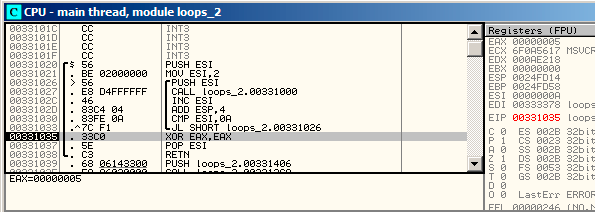
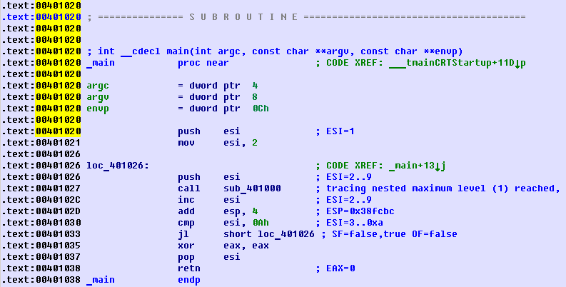

# 第十四章
# 循环结构

## 14.1 简单的例子
### 14.1.1 x86

在x86指令集中，有一些独特的LOOP指令，它们会检查ECX中的值，如果它不是0的话，它会逐渐递减ECX的值（减一），然后把控制流传递给LOOP操作符提供的标签处。也许，这个指令并不是多方便，所以，我没有看到任何现代编译器自动使用它。如果你看到哪里的代码用了这个结构，那它很有可能是程序员手写的汇编代码。

顺带一提，作为家庭作业，你可以试着解释以下为什么这个指令如此不方便。

C/C++循环操作是由for()、while()、do/while()命令发起的。

让我们从for()开始吧。

这个命令定义了循环初始值（为循环计数器设置初值），循环条件（比如，计数器是否大于一个阈值？），以及在每次迭代（增/减）时和循环体中做什么。

```
for(初始化; 条件; 每次迭代时执行的语句)
{
	循环体;
}
```

所以，它生成的代码也将被考虑为4个部分。

让我们从一个简单的例子开始吧：

```
#include <stdio.h>
void f(int i)
{
    printf ("f(%d)
", i);
};
int main()
{
    int i;
    for (i=2; i<10; i++)
    f(i);
    return 0;
};
```

反汇编结果如下（MSVC 2010）：

清单14.1: MSVC 2010

```
_i$ = -4
_main     PROC
        push    ebp
        mov     ebp, esp
        push    ecx
        mov     DWORD PTR _i$[ebp], 2       ; loop initialization
        jmp     SHORT $LN3@main
$LN2@main:
        mov     eax, DWORD PTR _i$[ebp]     ; here is what we do after each iteration:
        add     eax, 1                      ; add 1 to i value
        mov     DWORD PTR _i$[ebp], eax
$LN3@main:
        cmp     DWORD PTR _i$[ebp], 10      ; this condition is checked *before* each iteration
        jge     SHORT $LN1@main             ; if i is biggest or equals to 10, let’s finish loop
        mov     ecx, DWORD PTR _i$[ebp]     ; loop body: call f(i)
        push    ecx
        call    _f
        add     esp, 4
        jmp     SHORT $LN2@main             ; jump to loop begin
$LN1@main:                                  ; loop end
        xor     eax, eax
        mov     esp, ebp
        pop     ebp
        ret     0
_main ENDP
```

看起来没什么特别的。

GCC 4.4.1生成的代码也基本相同，只有一些微妙的区别。

清单14.1: GCC 4.4.1

```
main        proc near           ; DATA XREF: _start+17
var_20      = dword ptr -20h
var_4       = dword ptr -4
            push    ebp
            mov     ebp, esp
            and     esp, 0FFFFFFF0h
            sub     esp, 20h
            mov     [esp+20h+var_4], 2 ; i initializing
            jmp     short loc_8048476
loc_8048465:
            mov     eax, [esp+20h+var_4]
            mov     [esp+20h+var_20], eax
            call    f
            add     [esp+20h+var_4], 1 ; i increment
loc_8048476:
            cmp     [esp+20h+var_4], 9
            jle     short loc_8048465 ; if i<=9, continue loop
            mov     eax, 0
            leave
            retn
main        endp
```

现在，让我们看看如果我们打开了优化开关会得到什么结果（/Ox）：

清单14.3: 优化后的 MSVC

```
_main PROC
    push esi
    mov esi, 2
$LL3@main:
    push esi
    call _f
    inc esi
    add esp, 4
    cmp esi, 10 ; 0000000aH
    jl SHORT $LL3@main
    xor eax, eax
    pop esi
    ret 0
_main ENDP
```

要说它做了什么，那就是：本应在栈上分配空间的变量i被移动到了寄存器ESI里面。因为我们这样一个小函数并没有这么多的本地变量，所以它才可以这么做。 这么做的话，一个重要的条件是函数f（）不能改变ESI的值。我们的编译器在这里倒是非常确定。假设编译器决定在f（）中使用ESI寄存器的话，ESI的值将在函数的初始化阶段被压入栈保存，并且在函数的收尾阶段将其弹出（注：即还原现场，保证程序片段执行前后某个寄存器值不变）。这个操作有点像函数开头和结束时的PUSH ESI/ POP ESI操作对。

让我们试一试开启了最高优化的GCC 4.4.1（-03优化）。

清单14.4: 优化后的GCC 4.4.1

```
main    proc near
var_10  = dword ptr -10h
        push    ebp
        mov     ebp, esp
        and     esp, 0FFFFFFF0h
        sub     esp, 10h
        mov     [esp+10h+var_10], 2
        call    f
        mov     [esp+10h+var_10], 3
        call    f
        mov     [esp+10h+var_10], 4
        call    f
        mov     [esp+10h+var_10], 5
        call    f
        mov     [esp+10h+var_10], 6
        call    f
        mov     [esp+10h+var_10], 7
        call    f
        mov     [esp+10h+var_10], 8
        call    f
        mov     [esp+10h+var_10], 9
        call    f
        xor     eax, eax
        leave
        retn
main endp
```

GCC直接把我们的循环给分解成顺序结构了。

循环分解（Loop unwinding）对这些没有太多迭代次数的循环结构来说是比较有利的，移除所有循环结构之后程序的效率会得到提升。但是，这样生成的代码明显会变得很大。

好的，现在我们把循环的最大值改为100。GCC现在生成如下：

清单14.5: GCC

```
        public main
main    proc near
var_20  = dword ptr -20h
        push    ebp
        mov     ebp, esp
        and     esp, 0FFFFFFF0h
        push    ebx
        mov     ebx, 2 ; i=2
        sub     esp, 1Ch
        nop     ; aligning label loc_80484D0 (loop body begin) by 16-byte border
loc_80484D0:
        mov     [esp+20h+var_20], ebx ; pass i as first argument to f()
        add     ebx, 1 ; i++
        call    f
        cmp     ebx, 64h ; i==100?
        jnz     short loc_80484D0 ; if not, continue
        add     esp, 1Ch
        xor     eax, eax ; return 0
        pop     ebx
        mov     esp, ebp
        pop     ebp
        retn
main endp
```

这时，代码看起来非常像MSVC 2010开启/Ox优化后生成的代码。除了这儿它用了EBX来存储变量i。 GCC也确信f（）函数中不会修改EBX的值，假如它要用到EBX的话，它也一样会在函数初始化和收尾时保存EBX和还原EBX，就像这里main（）函数做的事情一样。

### 14.1.2 OllyDbg

让我们通过/Ox和/Ob0编译程序，然后放到OllyDbg里面查看以下结果。

看起来OllyDbg能够识别简单的循环，然后把它们放在一块，为了演示方便，大家可以看图14.1。

通过跟踪代码（F8， 步过）我们可以看到ESI是如何递增的。这里的例子是ESI = i = 6： 图14.2。

9是i的最后一个循环制，这也就是为什么JL在递增的最后不会触发，之后函数结束，如图14.3。


图14.1： OllyDbg main（）开始


图14.2： OllyDbg： 循环体刚刚递增了i，现在i=6



图14.3： OllyDbg中ESI=10，循环终止

### 14.1.2 x86:跟踪

像我们所见的一样，手动在调试器里面跟踪代码并不是一件方便的事情。这也就是我给自己写了一个跟踪程序的原因。

我在IDA中打开了编译后的例子，然后找到了PUSH ESI指令（作用：给f（）传递唯一的参数）的地址，对我的机器来说是0x401026，然后我运行了跟踪器：

`tracer.exe -l:loops_2.exe bpx=loops_2.exe!0x00401026`

BPX的作用只是在对应地址上设置断点然后输出寄存器状态。

在tracer.log中我看到执行后的结果：

```
PID=12884|New process loops_2.exe
(0) loops_2.exe!0x401026
EAX=0x00a328c8 EBX=0x00000000 ECX=0x6f0f4714 EDX=0x00000000
ESI=0x00000002 EDI=0x00333378 EBP=0x0024fbfc ESP=0x0024fbb8
EIP=0x00331026
FLAGS=PF ZF IF
(0) loops_2.exe!0x401026
EAX=0x00000005 EBX=0x00000000 ECX=0x6f0a5617 EDX=0x000ee188
ESI=0x00000003 EDI=0x00333378 EBP=0x0024fbfc ESP=0x0024fbb8
EIP=0x00331026
FLAGS=CF PF AF SF IF
(0) loops_2.exe!0x401026
EAX=0x00000005 EBX=0x00000000 ECX=0x6f0a5617 EDX=0x000ee188
ESI=0x00000004 EDI=0x00333378 EBP=0x0024fbfc ESP=0x0024fbb8
EIP=0x00331026
FLAGS=CF PF AF SF IF
(0) loops_2.exe!0x401026
EAX=0x00000005 EBX=0x00000000 ECX=0x6f0a5617 EDX=0x000ee188
ESI=0x00000005 EDI=0x00333378 EBP=0x0024fbfc ESP=0x0024fbb8
EIP=0x00331026
FLAGS=CF AF SF IF
(0) loops_2.exe!0x401026
EAX=0x00000005 EBX=0x00000000 ECX=0x6f0a5617 EDX=0x000ee188
ESI=0x00000006 EDI=0x00333378 EBP=0x0024fbfc ESP=0x0024fbb8
EIP=0x00331026
FLAGS=CF PF AF SF IF
(0) loops_2.exe!0x401026
EAX=0x00000005 EBX=0x00000000 ECX=0x6f0a5617 EDX=0x000ee188
ESI=0x00000007 EDI=0x00333378 EBP=0x0024fbfc ESP=0x0024fbb8
EIP=0x00331026
FLAGS=CF AF SF IF
(0) loops_2.exe!0x401026
EAX=0x00000005 EBX=0x00000000 ECX=0x6f0a5617 EDX=0x000ee188
ESI=0x00000008 EDI=0x00333378 EBP=0x0024fbfc ESP=0x0024fbb8
EIP=0x00331026
FLAGS=CF AF SF IF
(0) loops_2.exe!0x401026
EAX=0x00000005 EBX=0x00000000 ECX=0x6f0a5617 EDX=0x000ee188
ESI=0x00000009 EDI=0x00333378 EBP=0x0024fbfc ESP=0x0024fbb8
EIP=0x00331026
FLAGS=CF PF AF SF IF
PID=12884|Process loops_2.exe exited. ExitCode=0 (0x0)
```

我们可以看到ESI寄存器是如何从2变为9的。

甚至于跟踪器可以收集某个函数调用内所有寄存器的值，所以它被叫做跟踪器（a trace）。每个指令都会被它跟踪上，所有感兴趣的寄存器值都会被它提示出来，然后收集下来。 然后可以生成IDA能用的.idc-script。所以，在IDA中我知道了main()函数地址是0x00401020，然后我执行了：

`tracer.exe -l:loops_2.exe bpf=loops_2.exe!0x00401020,trace:cc`

bpf的意思是在函数上设置断点。

结果是我得到了loops_2.exe.idc和loops_2.exe_clear.idc两个脚本。我加载loops_2.idc到IDA中，然后可以看到图12.4所示的内容。

我们可以看到ESI在循环体开始时从2变化为9，但是在递增完之后，它的值从9（译注：作者原文是3，但是揣测是笔误，应为9。）变为了0xA（10）。我们也可以看到main（）函数结束时EAX被设置为了0。

编译器也生成了loops_2.exe.txt，包含有每个指令执行了多少次和寄存器值的一些信息：

清单14.6: loops_2.exe.txt

```
0x401020 (.text+0x20), e= 1 [PUSH ESI] ESI=1
0x401021 (.text+0x21), e= 1 [MOV ESI, 2]
0x401026 (.text+0x26), e= 8 [PUSH ESI] ESI=2..9
0x401027 (.text+0x27), e= 8 [CALL 8D1000h] tracing nested maximum level (1) reached,
skipping this CALL 8D1000h=0x8d1000
0x40102c (.text+0x2c), e= 8 [INC ESI] ESI=2..9
0x40102d (.text+0x2d), e= 8 [ADD ESP, 4] ESP=0x38fcbc
0x401030 (.text+0x30), e= 8 [CMP ESI, 0Ah] ESI=3..0xa
0x401033 (.text+0x33), e= 8 [JL 8D1026h] SF=false,true OF=false
0x401035 (.text+0x35), e= 1 [XOR EAX, EAX]
0x401037 (.text+0x37), e= 1 [POP ESI]
0x401038 (.text+0x38), e= 1 [RETN] EAX=0
```

生成的代码可以在此使用：



图14.4： IDA加载了.idc-script之后的内容

### 14.1.4 ARM

#### 无优化 Keil + ARM模式

```
main
    STMFD   SP!, {R4,LR}
    MOV     R4, #2
    B       loc_368
; ---------------------------------------------------------------------------
 
loc_35C                 ; CODE XREF: main+1C
    MOV     R0, R4
    BL      f
    ADD     R4, R4, #1
loc_368                 ; CODE XREF: main+8
    CMP     R4, #0xA
    BLT     loc_35C
    MOV     R0, #0
    LDMFD   SP!, {R4,PC}
```

迭代计数器i存储到了R4寄存器中。

```
MOV R4,#2初始化i。
MOV R0,R4 和 BL f 指令组成循环体，第一个指令为f（）准备参数，第二个用来调用它。
ADD R4,R4, #1 指令在每次迭代中为i加一。
CMP R4,#0xA 将i和0xA（10）比较，下一个指令BLT（Branch Less Than，分支小于）将在i<10时跳转。
否则， R0将会被写入0（因为我们的函数返回0），然后函数执行终止。
```

#### 优化后的 Keil + ARM模式

```
_main
        PUSH    {R4,LR}
        MOVS    R4, #2

loc_132             ; CODE XREF: _main+E
        MOVS    R0, R4
        BL      example7_f
        ADDS    R4, R4, #1
        CMP     R4, #0xA
        BLT     loc_132
        MOVS    R0, #0
        POP     {R4,PC}
```

事实上，是一样的。

#### 优化后的 Xcode（LLVM） + thumb-2 模式

```
_main
    PUSH    {R4,R7,LR}
    MOVW    R4, #0x1124 ; "%d
"
    MOVS    R1, #2
    MOVT.W  R4, #0
    ADD     R7, SP, #4
    ADD     R4, PC
    MOV     R0, R4
    BLX     _printf
    MOV     R0, R4
    MOVS    R1, #3
    BLX     _printf
    MOV     R0, R4
    MOVS    R1, #4
    BLX     _printf
    MOV     R0, R4
    MOVS    R1, #5
    BLX     _printf
    MOV     R0, R4
    MOVS    R1, #6
    BLX     _printf
    MOV     R0, R4
    MOVS    R1, #7
    BLX     _printf
    MOV     R0, R4
    MOVS    R1, #8
    BLX     _printf
    MOV     R0, R4
    MOVS    R1, #9
    BLX     _printf
    MOVS    R0, #0
    POP     {R4,R7,PC}
```

事实上，printf是在我的f（）函数里调用的：

```
void f(int i)
{
   // do something here
   printf ("%d", i);
};
```

所以，LLVM不仅仅是拆解了（unroll）循环，而且还把我的短函数f（）给作为内联函数看待了，这样，它把它的函数体内插了8遍，而不是用一个循环来解决。对于我们这种简短的函数来说，编译器这样做是有可能的。


#### ARM64: Optimizing GCC 4.9.1

#### ARM64: Non-optimizing GCC 4.9.1

### 14.1.5 MIPS

## 14.1.6 更多的一些事情

在编译器生成的代码里面，我们可以发现在i初始化之后，循环体并不会被执行，转而是先检查i的条件，在这之后才开始执行循环体。这么做是正确的，因为，如果循环条件在一开始就不满足，那么循环体是不应当被执行的。比如，在下面的例子中，就可能出现这个情况：

```
for (i=0; i<total_entries_to_process; i++)
    loop_body;
```

如果total_entries_to_process等于0，那么循环体就不应该被执行。这就是为什么应当在循环体被执行之前检查循环条件。 但是，开启编译器优化之后，如果编译器确定不会出现上面这种情况的话，那么条件检查和循环体的语句可能会互换（比如我们上面提到的简单的例子以及Keil、Xcode（LLVM）、MSVC的优化模式）。

## 14.2 内存块复制程序

### 14.2.1 直接实现

### 14.2.2 ARM in ARM mode

### 14.2.3 MIPS

### 14.2.4 向量化

## 14.3 小结

## 14.4 练习
