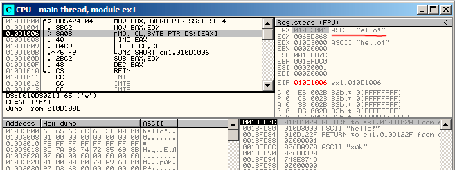
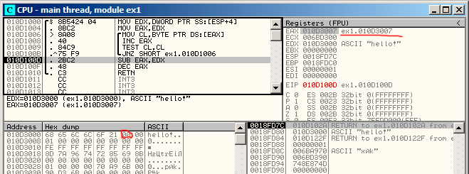
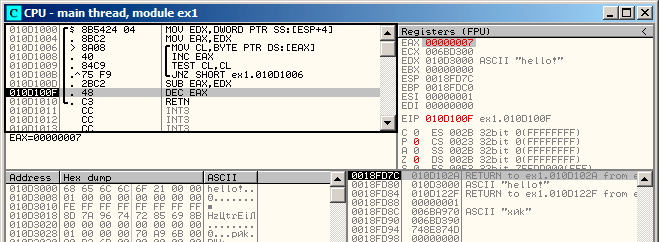

# 第十五章
# 对C-Strings的简单处理

## 15.1 strlen()

现在，让我们再看一眼循环结构。通常，strlen()函数是由while()来实现的。这就是MSVC标准库中strlen的做法：

```
int my_strlen (const char * str)
{
    const char *eos = str;
    while( *eos++ ) ;
    return( eos - str - 1 );
}
int main()
{
    // test
    return my_strlen("hello!");
};
```

## 15.1 x86

#### 无优化的 MSVC

让我们编译一下：

```
_eos$ = -4                  ; size = 4
_str$ = 8                   ; size = 4
_strlen PROC
    push    ebp
    mov     ebp, esp
    push    ecx
    mov     eax, DWORD PTR _str$[ebp]   ; place pointer to string from str
    mov     DWORD PTR _eos$[ebp], eax   ; place it to local varuable eos
$LN2@strlen_:
    mov     ecx, DWORD PTR _eos$[ebp]   ; ECX=eos
 
    ; take 8-bit byte from address in ECX and place it as 32-bit value to EDX with sign extension
 
    movsx   edx, BYTE PTR [ecx]
    mov     eax, DWORD PTR _eos$[ebp]   ; EAX=eos
    add     eax, 1 ; increment EAX
    mov     DWORD PTR _eos$[ebp], eax   ; place EAX back to eos
    test    edx, edx                    ; EDX is zero?
    je      SHORT $LN1@strlen_          ; yes, then finish loop
    jmp     SHORT $LN2@strlen_          ; continue loop
$LN1@strlen_:
 
    ; here we calculate the difference between two pointers
 
    mov     eax, DWORD PTR _eos$[ebp]
    sub     eax, DWORD PTR _str$[ebp]
    sub     eax, 1                      ; subtract 1 and return result
    mov     esp, ebp
    pop     ebp
    ret     0
_strlen_ ENDP
```

我们看到了两个新的指令：MOVSX（见13.1.1节）和TEST。

关于第一个：MOVSX用来从内存中取出字节然后把它放到一个32位寄存器中。MOVSX意味着MOV with Sign-Extent（带符号扩展的MOV操作）。MOVSX操作下，如果复制源是负数，从第8到第31的位将被设为1，否则将被设为0。

现在解释一下为什么要这么做。

C/C++标准将char（译注：1字节）类型定义为有符号的。如果我们有2个值，一个是char，另一个是int（int也是有符号的），而且它的初值是-2（被编码为0xFE），我们将这个值拷贝到int（译注：一般是4字节）中时，int的值将是0x000000FE，这时，int的值将是254而不是-2。因为在有符号数中，-2被编码为0xFFFFFFFE。 所以，如果我们需要将0xFE从char类型转换为int类型，那么，我们就需要识别它的符号并扩展它。这就是MOVSX所做的事情。

请参见章节“有符号数表示方法”。（35章）

我不太确定编译器是否需要将char变量存储在EDX中，它可以使用其中8位（我的意思是DL部分）。显然，编译器的寄存器分配器就是这么工作的。

然后我们可以看到TEST EDX, EDX。关于TEST指令，你可以阅读一下位这一节（17章）。但是现在我想说的是，这个TEST指令只是检查EDX的值是否等于0。

#### 无优化的 GCC

让我们在GCC 4.4.1下测试：

```
        public strlen
strlen  proc near
 
eos     = dword ptr -4
arg_0   = dword ptr 8
 
        push    ebp
        mov     ebp, esp
        sub     esp, 10h
        mov     eax, [ebp+arg_0]
        mov     [ebp+eos], eax
 
loc_80483F0:
        mov     eax, [ebp+eos]
        movzx   eax, byte ptr [eax]
        test    al, al
        setnz   al
        add     [ebp+eos], 1
        test    al, al
        jnz     short loc_80483F0
        mov     edx, [ebp+eos]
        mov     eax, [ebp+arg_0]
        mov     ecx, edx
        sub     ecx, eax
        mov     eax, ecx
        sub     eax, 1
        leave
        retn
strlen  endp
```

可以看到它的结果和MSVC几乎相同，但是这儿我们可以看到它用MOVZX代替了MOVSX。 MOVZX代表着MOV with Zero-Extend（0位扩展MOV）。这个指令将8位或者16位的值拷贝到32位寄存器，然后将剩余位设置为0。事实上，这个指令比较方便的原因是它将两条指令组合到了一起：xor eax,eax / mov al, [...]。

另一方面来说，显然这里编译器可以产生如下代码： mov al, byte ptr [eax] / test al, al，这几乎是一样的，但是，EAX高位将还是会有随机的数值存在。 但是我们想一想就知道了，这正是编译器的劣势所在——它不能产生更多能让人容易理解的代码。严格的说， 事实上编译器也并没有义务为人类产生易于理解的代码。

还有一个新指令，SETNZ。这里，如果AL包含非0， test al, al将设置ZF标记位为0。 但是SETNZ中，如果ZF == 0（NZ的意思是非零，Not Zero），AL将设置为1。用自然语言描述一下，如果AL非0，我们就跳转到loc_80483F0。编译器生成了少量的冗余代码，不过不要忘了我们已经把优化给关了。

####　优化后的 MSVC

让我们在MSVC 2012下编译，打开优化选项/Ox：

清单15.1: MSVC 2010 /Ox /Ob0

```
_str$ = 8               ; size = 4
_strlen     PROC
            mov     edx, DWORD PTR _str$[esp-4] ; EDX -> 指向字符的指针
            mov     eax, edx                    ; 移动到 EAX
$LL2@strlen:
            mov     cl, BYTE PTR [eax]          ; CL = *EAX
            inc     eax                         ; EAX++
            test    cl, cl                      ; CL==0?
            jne     SHORT $LL2@strlen           ; 否，继续循环
            sub     eax, edx                    ; 计算指针差异
            dec     eax                         ; 递减 EAX
            ret     0
_strlen ENDP
```

现在看起来就更简单点了。但是没有必要去说编译器能在这么小的函数里面，如此有效率的使用如此少的本地变量，特殊情况而已。

INC / DEC是递增 / 递减指令，或者换句话说，给变量加一或者减一。

#### 优化后的 MSVC + OllyDbg

我们可以在OllyDbg中试试这个（优化过的）例子。这儿有一个简单的最初的初始化：图15.1。 我们可以看到OllyDbg

找到了一个循环，然后为了方便观看，OllyDbg把它们环绕在一个方格区域中了。在EAX上右键点击，我们可以选择“Follow in Dump”，然后内存窗口的位置将会跳转到对应位置。我们可以在内存中看到这里有一个“hello！”的字符串。 在它之后至少有一个0字节，然后就是随机的数据。 如果OllyDbg发现了一个寄存器是一个指向字符串的指针，那么它会显示这个字符串。

让我们按下F8（步过）多次，我们可以看到当前地址的游标将在循环体中回到开始的地方：图15.2。我们可以看到EAX现在包含有字符串的第二个字符。

我们继续按F8，然后执行完整个循环：图15.3。我们可以看到EAX现在包含空字符（）的地址，也就是字符串的末尾。同时，EDX并没有改变，所以它还是指向字符串的最开始的地方。现在它就可以计算这两个寄存器的差值了。

然后SUB指令会被执行：图15.4。 差值保存在EAX中，为7。 但是，字符串“hello!”的长度是6，这儿7是因为包含了末尾的。但是strlen（）函数必须返回非0部分字符串的长度，所以在最后还是要给EAX减去1，然后将它作为返回值返回，退出函数。


图15.1： 第一次循环迭代起始位置



图15.2：第二次循环迭代开始位置



图15.3： 现在要计算二者的差了



图15.4： EAX需要减一

#### 优化过的GCC

让我们打开GCC 4.4.1的编译优化选项（-O3）：

```
        public strlen
strlen  proc near
 
arg_0   = dword ptr 8
 
        push    ebp
        mov     ebp, esp
        mov     ecx, [ebp+arg_0]
        mov     eax, ecx
 
loc_8048418:
        movzx   edx, byte ptr [eax]
        add     eax, 1
        test    dl, dl
        jnz     short loc_8048418
        not     ecx
        add     eax, ecx
        pop     ebp
        retn
strlen endp
```

这儿GCC和MSVC的表现方式几乎一样，除了MOVZX的表达方式。

但是，这里的MOVZX可能被替换为mov dl, byte ptr [eax]。

可能是因为对GCC编译器来说，生成此种代码会让它更容易记住整个寄存器已经分配给char变量了，然后因此它就可以确认高位在任何时候都不会有任何干扰数据的存在了。

之后，我们可以看到新的操作符NOT。这个操作符把操作数的所有位全部取反。可以说，它和XOR ECX, 0fffffffh效果是一样的。NOT和接下来的ADD指令计算差值然后将结果减一。在最开始的ECX出存储了str的指针，翻转之后会将它的值减一。

请参考“有符号数的表达方式”。（第35章）

换句话说，在函数最后，也就是循环体后面其实是做了这样一个操作：

```
ecx=str;
eax=eos;
ecx=(-ecx)-1;
eax=eax+ecx
return eax
```

这样做其实几乎相等于：

```
ecx=str;
eax=eos;
eax=eax-ecx;
eax=eax-1;
return eax
```

为什么GCC会认为它更棒呢？我不能确定，但是我确定上下两种方式都应该有相同的效率。

### 15.1.2 ARM
#### 32-bit ARM
#### 无优化 Xcode (LLVM) + ARM模式

清单15.2: 无优化的Xcode（LLVM）+ ARM模式

```
_strlen
 
eos     = -8
str     = -4
        SUB     SP, SP, #8 ; allocate 8 bytes for local variables
        STR     R0, [SP,#8+str]
        LDR     R0, [SP,#8+str]
        STR     R0, [SP,#8+eos]
 
loc_2CB8                ; CODE XREF: _strlen+28
        LDR     R0, [SP,#8+eos]
        ADD     R1, R0, #1
        STR     R1, [SP,#8+eos]
        LDRSB   R0, [R0]
        CMP     R0, #0
        BEQ     loc_2CD4
        B       loc_2CB8
; ----------------------------------------------------------------
 
loc_2CD4                ; CODE XREF: _strlen+24
        LDR     R0, [SP,#8+eos]
        LDR     R1, [SP,#8+str]
        SUB     R0, R0, R1 ; R0=eos-str
        SUB     R0, R0, #1 ; R0=R0-1
        ADD     SP, SP, #8 ; deallocate 8 bytes for local variables
        BX      LR
```

无优化的LLVM生成了太多的代码，但是，这里我们可以看到函数是如何在栈上处理本地变量的。我们的函数里只有两个本地变量，eos和str。

在这个IDA生成的列表里，我把var_8和var_4命名为了eos和str。

所以，第一个指令只是把输入的值放到str和eos里。

循环体从loc_2CB8标签处开始。

循环体的前三个指令（LDR、ADD、STR）将eos的值载入R0，然后值会加一，然后存回栈上本地变量eos。

下一条指令“LDRSB R0, [R0]”（Load Register Signed Byte，读取寄存器有符号字）将从R0地址处读取一个字节，然后把它符号扩展到32位。这有点像是x86里的MOVSX函数（见13.1.1节）。因为char在C标准里面是有符号的，所以编译器也把这个字节当作有符号数。我已经在13.1.1节写了这个，虽然那里是相对x86来说的。 需要注意的是，在ARM里会单独分割使用8位或者16位或者32位的寄存器，就像x86一样。显然，这是因为x86有一个漫长的历史上的兼容性问题，它需要和他的前身：16位8086处理器甚至8位的8080处理器相兼容。但是ARM确是从32位的精简指令集处理器中发展而成的。因此，为了处理单独的字节，程序必须使用32位的寄存器。 所以LDRSB一个接一个的将符号从字符串内载入R0，下一个CMP和BEQ指令将检查是否读入的符号是0，如果不是0，控制流将重新回到循环体，如果是0，那么循环结束。 在函数最后，程序会计算eos和str的差，然后减一，返回值通过R0返回。

注意：这个函数并没有保存寄存器。这是因为由ARM调用时的转换，R0-R3寄存器是“临时寄存器”（scratch register），它们只是为了传递参数用的，它们的值并不会在函数退出后保存，因为这时候函数也不会再使用它们。因此，它们可以被我们用来做任何事情，而这里其他寄存器都没有使用到，这也就是为什么我们的栈上事实上什么都没有的原因。因此，控制流可以通过简单跳转（BX）来返回调用的函数，地址存在LR寄存器中。

#### 优化后的 Xcode (LLVM) + thumb 模式

清单13.3: 优化后的 Xcode（LLVM） + thumb模式

```
_strlen
        MOV     R1, R0
 
loc_2DF6                ; CODE XREF: _strlen+8
        LDRB.W  R2, [R1],#1
        CMP     R2, #0
        BNE     loc_2DF6
        MVNS    R0, R0
        ADD     R0, R1
        BX      LR
```

在优化后的LLVM中，为eos和str准备的栈上空间可能并不会分配，因为这些变量可以永远正确的存储在寄存器中。在循环体开始之前，str将一直存储在R0中，eos在R1中。

`"LDRB.W R2, [R1],#1"`指令从R1内存中读取字节到R2里，按符号扩展成32位的值，但是不仅仅这样。 在指令最后的#1被称为“后变址”（Post-indexed address），这代表着在字节读取之后，R1将会加一。这个在读取数组时特别方便。

在x86中这里并没有这样的地址存取方式，但是在其他处理器中却是有的，甚至在PDP-11里也有。这是PDP-11中一个前增、后增、前减、后减的例子。这个很像是C语言（它是在PDP-11上开发的）中“罪恶的”语句形式ptr++、++ptr、ptr--、--ptr。顺带一提，C的这个语法真的很难让人记住。下为具体叙述：


C语言作者之一的Dennis Ritchie提到了这个可能是由于另一个作者Ken Thompson开发的功能，因此这个处理器特性在PDP-7中最早出现了（参考资料[28][29]）。因此，C语言编译器将在处理器支持这种指令时使用它。

然后可以指出的是循环体的CMP和BNE，这两个指令将一直处理到字符串中的0出现为止。

MVNS（翻转所有位，也即x86的NOT）指令和ADD指令计算cos-str-1.事实上，这两个指令计算出R0=str+cos。这和源码里的指令效果一样，为什么他要这么做的原因我在13.1.5节已经说过了。

显然，LLVM，就像是GCC一样，会把代码变得更短或者更快。

#### 优化后的 Keil + ARM 模式

清单15.4: 优化后的 Keil + ARM模式

```
_strlen
        MOV     R1, R0
loc_2C8                 ; CODE XREF: _strlen+14
        LDRB    R2, [R1],#1
        CMP     R2, #0
        SUBEQ   R0, R1, R0
        SUBEQ   R0, R0, #1
        BNE     loc_2C8
        BX      LR
```

这个和我们之前看到的几乎一样，除了str-cos-1这个表达式并不在函数末尾计算，而是被调到了循环体中间。 可以回忆一下-EQ后缀，这个代表指令仅仅会在CMP执行之前的语句互相相等时才会执行。因此，如果R0的值是0，两个SUBEQ指令都会执行，然后结果会保存在R0寄存器中。

#### ARM64
#### Optimizing GCC (Linaro) 4.9

#### Non-optimizing GCC (Linaro) 4.9

### 15.1.3 MIPS
