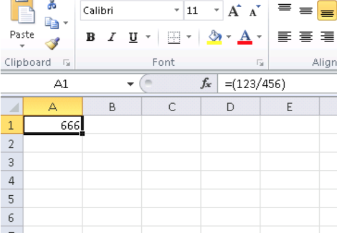

# 第60章 
# 寻找合适的指令

如果程序使用了FPU指令但使用不多，你可以尝试用调试器手工逐个检查。

举个例子，我们可能会对用户如何在微软的Excel中输入计算公式感兴趣，比如除法操作。

如果我们加载excel.exe(Offic 2010)版本为14.0.4756.1000 到IDA中，列出所有的条目，查找每一条FDIV指令(除了使用常量作为第二个操作数的——显然不是我们所关心的)：

```
cat EXCEL.lst | grep fdiv | grep -v dbl_ > EXCEL.fdiv
```
然后我们就会看到有144条相关结果。

我们可以在Excel中输入像"=(1/3)"这样的字符串然后对指令进行检查。

通过使用调试器或者tracer(一次性检查4条指令)检查指令，我们幸运地发现目标指令是第14个：

```
.text:3011E919 DC 33		fdiv    qword ptr [ebx]
```
```
PID=13944|TID=28744|(0) 0x2f64e919 (Excel.exe!BASE+0x11e919)
EAX=0x02088006 EBX=0x02088018 ECX=0x00000001 EDX=0x00000001
ESI=0x02088000 EDI=0x00544804 EBP=0x0274FA3C ESP=0x0274F9F8
EIP=0x2F64E919
FLAGS=PF IF
FPU ControlWord=IC RC=NEAR PC=64bits PM UM OM ZM DM IM
FPU StatusWord=
FPU ST(0): 1.000000
```
ST(0)存放了第一个参数，[EBX]存放了第二个参数。

FDIV(FSTP)之后的指令在内存中写入了结果：

```	
.text:3011E91B DD 1E		fstp    qword ptr [esi]
```

如果我们设置一个断点，就可以看到结果：

```
PID=32852|TID=36488|(0) 0x2f40e91b (Excel.exe!BASE+0x11e91b)
EAX=0x00598006 EBX=0x00598018 ECX=0x00000001 EDX=0x00000001
ESI=0x00598000 EDI=0x00294804 EBP=0x026CF93C ESP=0x026CF8F8
EIP=0x2F40E91B
FLAGS=PF IF
FPU ControlWord=IC RC=NEAR PC=64bits PM UM OM ZM DM IM
FPU StatusWord=C1 P
FPU ST(0): 0.333333

```

我们也可以恶作剧地修改一下这个值：

```
tracer -l:excel.exe bpx=excel.exe!BASE+0x11E91B,set(st0,666)
```
```
PID=36540|TID=24056|(0) 0x2f40e91b (Excel.exe!BASE+0x11e91b)
EAX=0x00680006 EBX=0x00680018 ECX=0x00000001 EDX=0x00000001
ESI=0x00680000 EDI=0x00395404 EBP=0x0290FD9C ESP=0x0290FD58
EIP=0x2F40E91B
FLAGS=PF IF
FPU ControlWord=IC RC=NEAR PC=64bits PM UM OM ZM DM IM
FPU StatusWord=C1 P
FPU ST(0): 0.333333
Set ST0 register to 666.000000

```

Excel在这个单元中显示666，我们也可以确信的确找到了正确的位置。


如果我们尝试使用同样的Excel版本，但是是64位的，会发现只有12个FDIV指令，我们的目标指令在第三个。

```
tracer.exe -l:excel.exe bpx=excel.exe!BASE+0x1B7FCC,set(st0,666)
```

看起来似乎许多浮点数和双精度类型的除法操作都被编译器用SSE指令比如DIVSD(DIVSD总共出现了268次)替换了。

