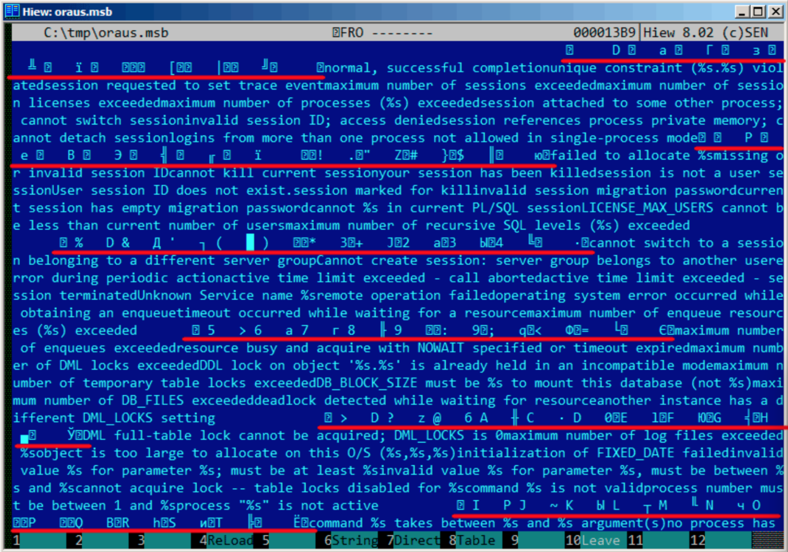
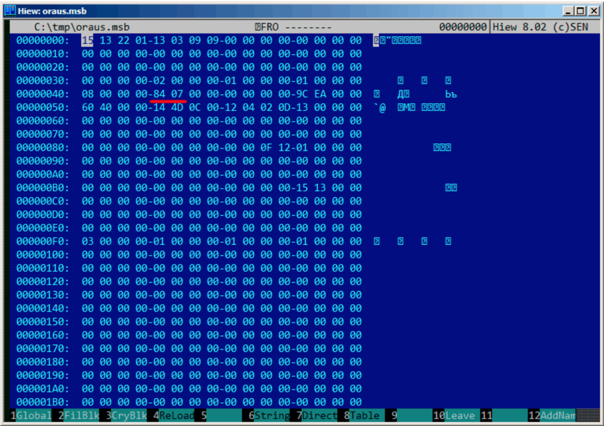
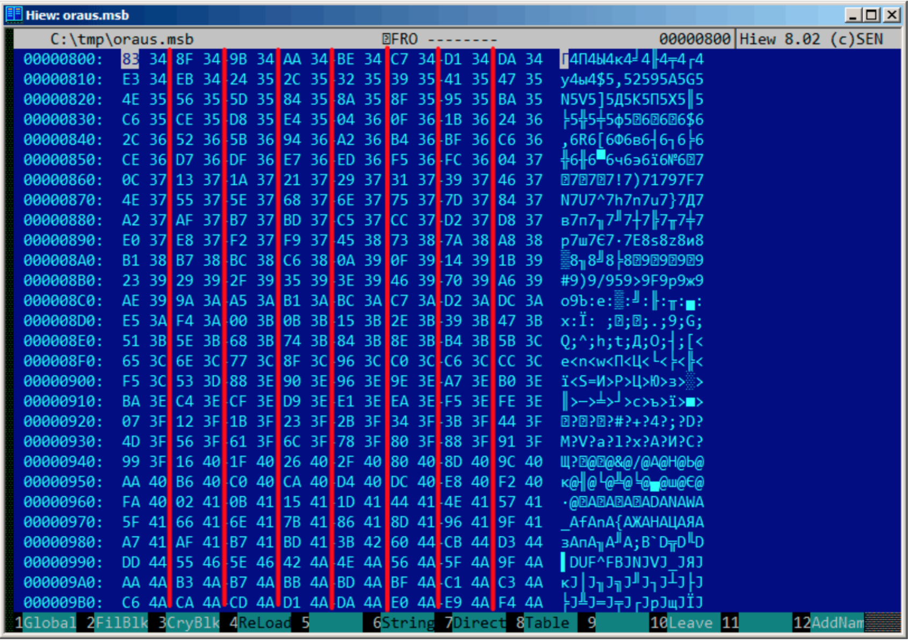

# 第八十七章
# Oracle RDBMS:.MSB-files

这个二进制文件包含了错误信息和对应的错误码。我们来理解它的格式然后找到unpack方法。

这里有文本格式的Oracle RDBMS错误信息，因此我们可以比对文本和pack后的二进制文件。

下面是ORAUS.MSG文本文件的开头，一些无关紧要的注释已经去掉：

```
00000, 00000, "normal, successful completion"
00001, 00000, "unique constraint (%s.%s) violated"
00017, 00000, "session requested to set trace event"
00018, 00000, "maximum number of sessions exceeded"
00019, 00000, "maximum number of session licenses exceeded"
00020, 00000, "maximum number of processes (%s) exceeded"
00021, 00000, "session attached to some other process; cannot switch session"
00022, 00000, "invalid session ID; access denied"
00023, 00000, "session references process private memory; cannot detach session"
00024, 00000, "logins from more than one process not allowed in single-process mode"
00025, 00000, "failed to allocate %s"
00026, 00000, "missing or invalid session ID"
00027, 00000, "cannot kill current session"
00028, 00000, "your session has been killed"
00029, 00000, "session is not a user session"
00030, 00000, "User session ID does not exist."
00031, 00000, "session marked for kill"
...
```

第一个数字是错误码，第二个可能是附加的标志，我不太确定。

现在我们来打开ORAUS.MSB二进制文件，找到这些文本字符串。这里有：



可以看到，这些文本字符串之间(包括ORAUS.MSG文件开头的那些)插入了一些二进制值。通过快速调查分析可发现二进制文件的主要部分按0x200(512)字节的大小进行分割。

咱们来看看第一个块的内容：


这里可以看到第一条错误信息文本。同时也看到错误信息之间没有0字节。这意味着没有以null结尾的c字符串。因此，每一条错误信息的长度值肯定以某种形式加密了。我们再来找找错误码。ORAUS.MSG文件这样开始：0，1，17(0x11),18 (0x12), 19 (0x13), 20 (0x14), 21 (0x15), 22 (0x16), 23 (0x17), 24 (0x18)...我在块头找到这些数字并且用红线标注出来了。错误码的间隔是6个字节。这意味着可能有6个字节分配给每条错误信息。

第一个16位值(0xA或者10)表示每个块的消息数量：我通过分析其他块证实了这一点，的确是这样：错误信息大小不定，有的长有的短。但是块大小总是固定的，所以你永远也不知道每个块可以pack多少条文本信息。

我注意到，既然这些c字符串不以null结尾，那么他们的大小一定在某处被加密了。第一个字符串"normal, successful completion"的大小是29(0x1D)字节。第二个字符串"unique constraint (%s.%s) violated"的大小是34(0x22)字节。在块里面找不到这些值(0x1D和0x22)。

还有一点，Oracle RDBMS需要知道需要加载的字符串在块中的位置，对么？第一个字符串"normal, successful completion"从地址0x14444(如果我们从文件开始处计数的话)或者0x44(从块开始处计数)开始。第二个字符串"unique constraint (%s.%s) violated"从0x1461(从文件开始处计算)或者0x61(从块开始处计算)开始。这些数字(0x44和0x61)看上去很熟悉！我们能在块的开始处找到他们。

因此，每个6字节块是：

*	16比特错误码
*	16比特0(或者附加标志)
*	16比特当前块文本字符串起始位置

可以通过快速核对其他值证明我是对的。然后这里还有最后一个6字节块，错误码为0，从最后一条错误信息的最后一个字符后开始。也许这就是确定文本信息长度的方法?我们刚刚枚举了6字节块来寻找我们需要的错误码，然后我们找到了文本字符串的位置，接着我们通过查看下一个6字节块获取文本字符串的位置。这样我们就找到了字符串的边界。这种方法通过不保存文本字符串的大小节省了一些空间。我不敢说它特别省，但是这是一个聪明的技巧。

我们再回到.MSB文件的头部：



可以迅速找到文件中记录块数量的值(用红线标注出来了)，然后检查了其他.MSB文件，结果发现都是这样的。这里还有很多其他值，但我没有查看他们，因为我的工作已经完成了(一个unpack工具)。如果我要写一个.MSB文件packer，那么我可能需要理解其他值的含义。

头的后面接着一个可能包含16比特值的表：



其大小可以直观的划出来(我用红线画出)。在dump这些值的过程中，我发现每个16比特的值是每个块最后一个错误码。

这就是如何快速找到Oracle RDBMS错误信息的方法：

*	加载那个我称为last_errnos的表(包含每个块最后一个错误码)；
*	找到包含我们所需错误码的块，假定所有的错误码的增加跨越了每个块到所有文件；
*	加载特殊块；
*	枚举6字节结构体直到找到目标错误码；
*	从下一个6字节块获取最后一个字符的位置；
*	加载这个范围内错误信息所有的字符。

这是我编写的unpack.MSB文件的c程序：[beginners.re](http://go.yurichev.com/17213)

这是我用作实例的两个文件(Oracle RDBMS 11.1.0.6):[beginners.re](http://go.yurichev.com/17214),[beginners.re](http://go.yurichev.com/17215)

## 87.1 总结

这种方法对于许多现代计算机来说也许太老了，假如这个文件格式是80年代中期某个具有内存/硬盘空间节省意识的硬件开发者设计的。尽管如此，这仍是一个有趣又简单的任务，因为不需要分析Oracle RDBMS的代码就能理解特殊文件的格式。


	


