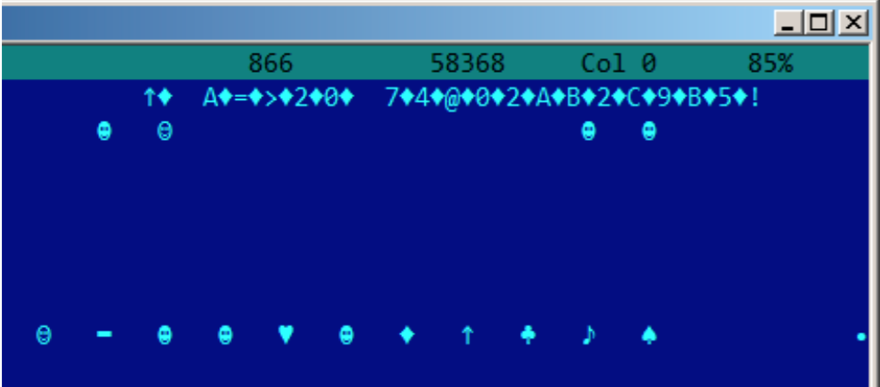

#第57章 
##字符串

### 57.1 文本字符串

#### 57.1.1 C/C++

普通的C字符串是以零结束的(ASCIIZ字符串)。

C字符串格式(以零结束)是这样的是出于历史原因。[Rit79中]:

```
A minor difference was that the unit of I/O was the word, not the byte, because the PDP-7 was a word- addressed machine. In practice this meant merely that all programs dealing with character streams ignored null characters, because null was used to pad a file to an even number of characters.
```

在Hiew或者FAR Manager中，这些字符串看上去是这样的：

```
int main() {
printf ("Hello, world!\n");
};
```


####57.1.2 Borland Delphi

在Pascal和Borland Delphi中字符串为8-bit或者32-bit长。

举个例子：


```
CODE:00518AC8                 dd 19h
CODE:00518ACC aLoading___Plea db 'Loading... , please wait.',0
...
CODE:00518AFC                 dd 10h
CODE:00518B00 aPreparingRun__ db 'Preparing run...',0
```

####57.1.3 Unicode

通常情况下，称Unicode是一种编码字符串的方法，每个字符占用2个字节或者16bit。这是一种常见的术语错误。在世界上许多语言系统中，Unicode是一种用于给每个字符分配数字的标准，而不是用于描述编码的方法。

最常用的编码方法是：UTF-8(在Internet和*NIX系统中使用较多)和UTF-16LE(在Windows中使用)。

**UTF-8**

UTF-8是最成功的字符编码方法之一。所有拉丁符号编码成ASCII，而超出ASCII表的字符的编码使用几个字节。0的编码方式和以前一样，所有的车标准C字符串函数处理UTF-8字符串和处理其他字符串一样。

我们来看看不同语言中的符号在UTF-8中是如何被编码的，在FAR中看上去什么样的，使用[437内码表](http://go.yurichev.com/17304):



就像你看到的一样，英语字符串看上去和ASCII编码的一样。匈牙利语使用一些拉丁符号加上变音标志。这些符号使用几个字节编码。我用红色下划线标记出来了。对于冰岛语和波兰语是一样的。我在开始处使用"Euro"通行符号，编码为3个字节。这里剩下的语言系统与拉丁文没有联系。至少Russian，Arabic，Hebrew和Hindi我们可以看到重复的字节，这并不稀奇：语言系统的所有符号通常位于同一个Unicode表中，所以他们的号码前几个数字相同。

开始，在"How much?"之前，我们看见了3个字节，实际上是BOM。BOM定义了使用的编码系统。

**UTF-16LE**

在Windows中，许多win32函数带有后缀 -A和-W。第一种类型的函数用于处理普通字符串，第二中类型的函数用于处理UTF-16LE(wide)，每个符号存储类型通常为16比特的short。

UTF-16中拉丁符号在Hiew和FAR中看上去像插入了0字节：
```
int wmain() {
wprintf (L"Hello, world!\n");
};
```


在Windows NT系统中经常可以看见这样的：



在IDA中，占两个字节通常被称为Unicode：

```
.data:0040E000 aHelloWorld:
.data:0040E000                 unicode 0, <Hello, world!>
.data:0040E000                 dw 0Ah, 0
```

下面是俄语字符串在UTF-16LE中如何被编码：


容易发现的是，符号被插入了方形字符(ASCII码为4).实际上，西里尔符号位于Unicode第四个平面。因此，在UTF-16LE中，西里尔符号的范围为0x400到0x4FF.

我们回到使用多种语言书写的字符串的例子中吧。下面是他们在UTF-16LE中的样子。


这里我们也能看到开始处有一个BOM。所有的拉丁字符都被插入了一个0字节。我也给一些带有变音符号的字符标注了红色下划线(匈牙利语和冰岛语)。

####57.1.4 Base64

Base64编码方法在需要将二进制数据以文本字符串的形式传输的情况下使用较多。实际上，这种算法将3个二进制字节编码为4个可打印字符：所有拉丁字母(包括大小写)，数字，加号，除号，共64个字符。

Base64字符串一个显著的特性是他们经常(并不总是)以1个或者2个等号结尾，举个例子：

```

AVjbbVSVfcUMu1xvjaMgjNtueRwBbxnyJw8dpGnLW8ZW8aKG3v4Y0icuQT+qEJAp9lAOuWs=

```


```
WVjbbVSVfcUMu1xvjaMgjNtueRwBbxnyJw8dpGnLW8ZW8aKG3v4Y0icuQT+qEJAp9lAOuQ==
```

等号不会在base-64编码的字符串中间出现。

###57.2 Error/debug messages 

调试信息非常有帮助。在某种程度上，调试信息报告了程序当前的行为。通常这些printf类函数，写入信息到log文件中，在release模式下不写任何东西但会显示调用信息。如果本地或全局变量dump到了调试信息中，可能会有帮助，至少能获取变量名。举个例子，在Oracle RDBMS中有一个这样的函数 ksdewt()。

文本字符串常常很有帮助。IDA反汇编器可以展示指定字符串被哪个函数在哪里使用。经常会发生有趣的状况。

错误信息也很有帮助。在Oracle RDBMS中，错误信息会报告使用的一系列函数。

更多相关信息：[blog.yurichev.com](blog.yurichev.com)。

快速找到哪个函数在什么情况下报告了错误信息是可以做到的。顺便说一句，这也是copy-protection系统为什么要设置模糊而难懂的错误信息或错误码。没有人会为软件破解者仅仅通过错误信息就快速找到了copy-protection被触发的原因而感到高兴。

一个关于错误信息编码的例子：78.2节

###57.3 Suspicious magic strings

一些幻数字符串通常使用在后门红，看上去很神秘。举个例子，下面有一个[TP-Link WR740路由器的后门](http://sekurak.pl/tp-link-httptftp-backdoor/)。使用下面的URL可以激活后门：[http://192.168.0.1/userRpmNatDebugRpm26525557/start_art.html](http://192.168.0.1/userRpmNatDebugRpm26525557/start_art.html)。

实际上，"userRpmNatDebugRpm26525557"字符串在硬件中显示。在后门信息泄漏前，这个字符串并不能被google到。你在任何RFC中都找不到这个。你也无法在任何计算机科学算法中找到使用了这个奇怪字节序列。并且这看上去不像错误信息也不像调试信息。所以，调查这样一个奇怪字符串的用途是明智的。

有时，像这样的字符串使用了base64编码。所以解码后然后再看一遍是明智的，甚至扫一眼就够了。

更确切的说，这种隐藏后门的方法称为“security through obscurity”。







